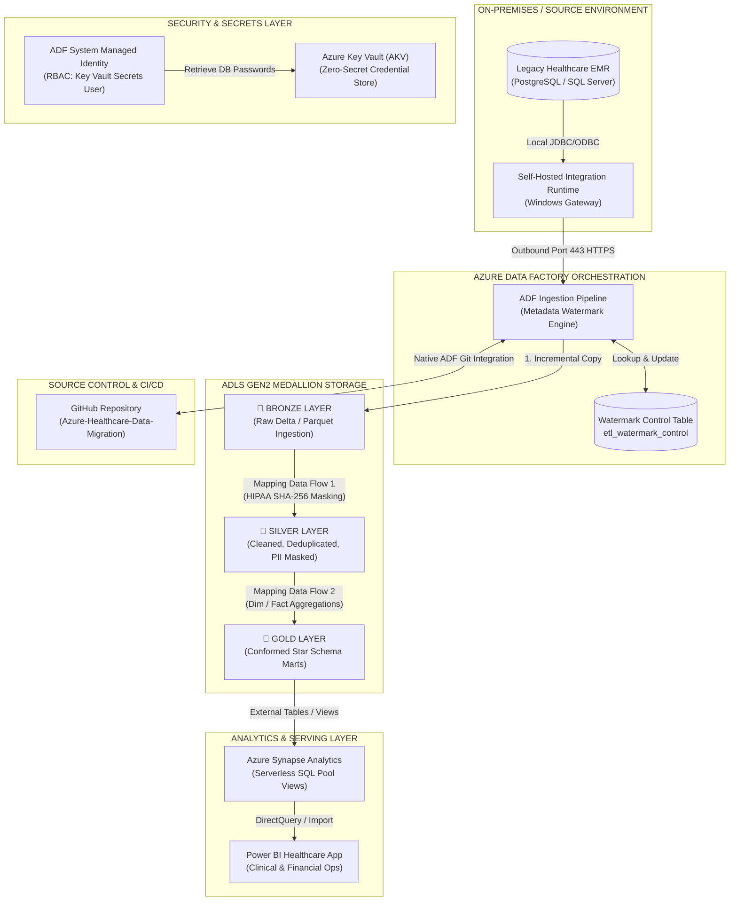

# Azure Healthcare Data Migration & Medallion Lakehouse

[](adf/)
[](docs/architecture_spec.md)
[](sql/)
[](docs/)
[](docs/architecture_spec.md#hipaa-security--pii-masking)
[-blueviolet)](docs/project_roadmap.md#phase-2-on-premise-emr-database--shir-gateway-setup)

---

## Executive Summary

**Azure Healthcare Data Migration & Medallion Lakehouse** is an enterprise-grade cloud data engineering reference architecture. Designed to showcase production-level data engineering, cloud networking, and security governance, this project migrates a legacy on-premises **Electronic Medical Records (EMR) & Revenue Cycle Management (RCM)** system into a modern **Azure Data Lake Storage Gen2 (ADLS Gen2)** Medallion architecture.

This solution demonstrates how modern data organizations eliminate on-prem legacy database bottlenecks, enforce strict **HIPAA compliance and PII data masking**, automate **metadata-driven watermark incremental delta ingestion**, and serve low-latency clinical and financial analytics to executive leadership via **Azure Synapse Serverless SQL** and **Power BI**.

---

## End-to-End Architecture



---

## Key Technical Highlights

1. **Hybrid Cloud Connectivity (SHIR)**:
   - Zero inbound firewall traversal. Local Windows Self-Hosted Integration Runtime (SHIR) creates secure outbound HTTPS (port 443) connections to Azure Data Factory.
2. **Zero-Secret Cloud Security**:
   - Azure Key Vault stores all database passwords and connection strings.
   - Azure Data Factory uses its System-Assigned Managed Identity (SMI) with `Storage Blob Data Contributor` on ADLS Gen2 and `Key Vault Secrets User` on Key Vault. No plaintext credentials are ever stored in pipeline JSON or Git.
3. **Metadata-Driven Watermark Incremental Loading**:
   - Reusable parameterized ADF copy pipelines dynamically evaluate high-watermark timestamps from a control table (`etl_watermark_control`), extracting only modified records without full table scans.
4. **Medallion Lakehouse Data Flows**:
   - **Bronze**: Append-only raw Parquet snapshot storage partitioned by ingestion date.
   - **Silver**: Deduplicated, cleansed Delta files with HIPAA-compliant SHA-256 PII hashing on sensitive attributes (`ssn`, `patient_name`).
   - **Gold**: Conformed dimensional Star Schema (`Dim_Patient`, `Dim_Provider`, `Dim_Diagnosis`, `Fact_Encounters`, `Fact_Claims`).
5. **Serverless SQL Serving Layer**:
   - Azure Synapse Serverless SQL views query Gold Delta tables on-demand via `OPENROWSET`, providing instant queryability with zero idle compute costs.
6. **Executive Power BI Reporting**:
   - High-impact dashboard visualizing Average Length of Stay (ALOS), 30-day hospital readmissions, claim denial rates %, and reimbursement cycles.

---

## Project Structure

```text
├── .agents/
│   └── rules/
│       └── migration-coaching-rule.md   # Architectural coaching & progress guidelines
├── adf/                                 # Azure Data Factory pipeline & data flow JSON definitions
│   ├── pipeline/
│   ├── dataflow/
│   ├── dataset/
│   └── linkedService/
├── docs/
│   ├── architecture_spec.md             # Detailed technical architecture specification
│   └── project_roadmap.md               # 6-Phase milestone implementation guide
├── scripts/                             # Utility PowerShell & Python automation scripts
├── sql/                                 # On-prem DDL, seed data, and Synapse Serverless SQL views
│   ├── 01_emr_schema_ddl.sql
│   ├── 02_emr_seed_data.sql
│   └── 03_synapse_views.sql
├── migration_learning_state.json        # Authoritative project progress tracker state
└── README.md                            # Executive project documentation
```
