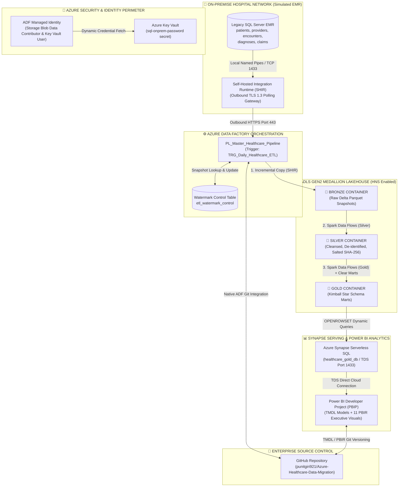

# 🏥 Azure Healthcare Data Migration & Medallion Lakehouse

[](https://github.com/punitgiri921/Azure-Healthcare-Data-Migration)
[](adf/)
[](docs/architecture_spec.md)
[](sql/)
[](powerbi/)
[](docs/architecture_spec.md#hipaa-security--pii-masking)

---

## 📌 Executive Summary

**Azure Healthcare Data Migration & Medallion Lakehouse** is an enterprise-grade cloud data engineering solution designed to migrate legacy on-premise **Electronic Medical Records (EMR)** and **Revenue Cycle Management (RCM)** databases into a modern, HIPAA-compliant **Azure Data Lake Storage Gen2 (ADLS Gen2)** Medallion architecture.

The project demonstrates an end-to-end cloud migration lifecycle:
1. **Secure Hybrid Ingestion**: Extracting legacy relational EMR data without exposing internal hospital firewalls using **Self-Hosted Integration Runtime (SHIR)** over outbound HTTPS port 443.
2. **Zero-Secret Governance**: Enforcing role-based access with **Azure Key Vault** and **System-Assigned Managed Identity (SMI)** with zero credentials tracked in code or Git.
3. **Incremental Delta ETL**: Implementing high-watermark control tables with snapshot isolation to extract delta records and land them as append-only Parquet in the **Bronze Lakehouse**.
4. **HIPAA Safe Harbor De-identification**: Executing Spark **Mapping Data Flows** in **Silver** to de-identify PII via cryptographic salted SHA-256 hashing on Social Security Numbers.
5. **Kimball Star Schema Modeling**: Transforming clinical encounters and billing claims into dimensional **Gold** marts (`Dim_Patient`, `Dim_Provider`, `Dim_Diagnosis`, `Fact_Encounters`, `Fact_Claims`) with surrogate keys.
6. **Serverless Serving Layer**: Exposing Gold marts via **Azure Synapse Serverless SQL** views with zero persistent relational storage overhead and $0 idle compute costs.
7. **Developer-Mode Analytics (PBIP)**: Authoring an interactive executive operations dashboard in **Power BI Desktop Developer Mode (PBIP)** with Git-versioned **TMDL** semantic models and 10 core healthcare DAX KPIs.

---

## 🏛️ End-to-End Architectural Data Flow



---

## ⚡ Live Master Pipeline Verification Telemetry

The automated master orchestration pipeline (`PL_Master_Healthcare_Pipeline`) was executed and verified end-to-end in Azure:

* **Pipeline Run ID**: `4c16ba7b-2782-4ed5-9890-d3ab16b48013`
* **Execution Status**: 🟢 **100% Succeeded**
* **Trigger**: Scheduled via `TRG_Daily_Healthcare_ETL` (Daily recurring execution)

| Activity Stage | Underlying Compute | Execution Time | Description |
| :--- | :--- | :--- | :--- |
| **`EP_Run_Bronze_Ingestion`** | SHIR + ADF Copy Engine | **4m 14s** | Evaluates watermark timestamps, dynamically pulls delta records from on-prem SQL Server, and writes Bronze Parquet partitions. |
| **`P_Run_Silver_Transformations`** | Azure IR (Spark Cluster) | **3m 28s** | Concurrently runs 5 Mapping Data Flows to de-identify PII, hash SSNs, validate date ranges, and calculate clinical metrics. |
| **`EP_Run_Gold_Star_Schema`** | Azure IR (Spark Cluster) | **1m 08s** | Executes `DEL_Clear_Gold_Marts` to ensure lakehouse idempotency, then rebuilds conformed dimension and fact tables. |
| **Total Pipeline Duration** | End-to-End Orchestration | **~8m 50s** | Full hybrid-cloud delta extraction to analytical serving. |

---

## 🥇 Gold Kimball Star Schema & Serving Layer

The Gold layer structures data into a dimensional Star Schema exposed via **Azure Synapse Serverless SQL** (`healthcare_gold_db`):

```
       [gold.dim_patient]                     [gold.dim_provider]
       (patient_sk, age_group)                (provider_sk, specialty)
                 │                                       │
           (1)   │                                 (1)   │
                 ▼                                       ▼
                 └────────► [gold.fact_encounters] ◄─────┘
                            (encounter_sk, length_of_stay_days)
                                       │
                                 (1)   │
                                       ▼
                             [gold.fact_claims]
                             (GenClaimSK, billed_amount, paid_amount, is_denied)
```

* **Synapse Serverless Database**: `healthcare_gold_db`
* **Collation**: `Latin1_General_100_BIN2_UTF8` (Required for optimal string predicate pushdown and UTF-8 Parquet decoding).
* **Direct TDS Queryability**: Serverless SQL queries ADLS Gen2 directly via `OPENROWSET(BULK 'folder/*.parquet', DATA_SOURCE = 'gold_lakehouse', FORMAT = 'PARQUET')` without loading data into relational storage disks ($0 idle compute cost).

---

## 📈 Power BI Developer Project (PBIP) & Executive Dashboard

The reporting tier is built using **Power BI Desktop Developer Mode (PBIP)**, storing all semantic models in **TMDL (Tabular Model Definition Language)** and visual layouts in **PBIR (Power BI Enhanced Report)** format under version control:

📁 `powerbi/`
- 📄 `Healthcare-Analytics-Report.pbip` (Project manifest)
- 📁 `Healthcare-Analytics-Report.SemanticModel/` (TMDL model, tables, relationships, partitions)
- 📁 `Healthcare-Analytics-Report.Report/` (PBIR visual container JSON definitions)

### Core Clinical & Financial DAX Measures (`_Measures` Table)

| Measure Name | Business Domain | DAX Implementation |
| :--- | :--- | :--- |
| **`Total Patients`** | Population Health | `DISTINCTCOUNT('gold dim_patient'[patient_sk])` |
| **`Total Encounters`** | Clinical Volume | `COUNTROWS('gold fact_encounters')` |
| **`Avg Length of Stay`** | Hospital Bed Efficiency | `ROUND(AVERAGE('gold fact_encounters'[length_of_stay_days]), 1)` |
| **`Total Billed`** | Gross Revenue | `SUM('gold fact_claims'[billed_amount])` |
| **`Total Paid`** | Net Realized Revenue | `SUM('gold fact_claims'[paid_amount])` |
| **`Total Patient Responsibility`** | Out-of-Pocket Liability | `SUM('gold fact_claims'[patient_responsibility])` |
| **`Total Denied Claims`** | Claim Exceptions | `CALCULATE(COUNTROWS('gold fact_claims'), 'gold fact_claims'[is_denied] = TRUE())` |
| **`Denial Rate`** | Revenue Cycle KPI | `DIVIDE([Total Denied Claims], COUNTROWS('gold fact_claims'), 0)` |
| **`Net Collection Rate`** | Cash Realization Rate | `DIVIDE([Total Paid], [Total Billed], 0)` |
| **`Avg Billed per Encounter`** | Unit Economics | `DIVIDE([Total Billed], [Total Encounters], 0)` |

### Executive Dashboard Features
- **Row 1 (Executive KPI Cards)**: High-level metrics for hospital administration (Active Patients, Total Admissions, Average Length of Stay, Gross Billed, Denial Rate %).
- **Row 2 (Clinical Operations & Financial Realization)**:
  - *Clustered Bar Chart*: Inpatient vs Outpatient vs Emergency volume breakdown.
  - *Clustered Column Chart*: Gross Billed vs Net Realized Cash across Provider Specialties.
- **Row 3 (Demographics & Diagnostics)**:
  - *Age Group Breakdown*: Adult (18-64) vs Senior (65+) patient volume.
  - *Claim Denial Diagnostics*: Denial volume categorized by exact adjudication root cause (`Pre-authorization missing`, etc.).
  - *Interactive Slicer*: Dynamic cross-filtering by Provider Specialty across all clinical and financial metrics simultaneously.

---

## 🛠️ Enterprise Engineering Challenges & Resolutions

| Challenge | Root Cause | Engineering Solution |
| :--- | :--- | :--- |
| **Inbound Firewall Restrictions** | Corporate healthcare networks forbid opening inbound ports to public cloud IP ranges. | Deployed a **Self-Hosted Integration Runtime (SHIR)** on Windows inside the local network. The SHIR establishes outbound HTTPS/TLS 1.3 polling over port 443; zero inbound firewall rules were opened. |
| **Plaintext Credential Leaks** | Hardcoding database passwords in ADF linked service JSON risks leaking credentials into GitHub. | Configured an **Azure Key Vault** secret store with **System-Assigned Managed Identity (SMI)** authentication. ADF dynamically requests time-bound tokens via Microsoft Entra ID. |
| **Watermark Array Ingestion Errors** | Unpivoting control tables resulted in an array format where ADF threw `property last_watermark_value doesn't exist`. | Structured the ADF lookup query to return a pivoted record and adjusted expressions to use array-safe indexing: `@activity('LKP_Get_Watermark_Control').output.value[0].<column>`. |
| **ADF Downstream Dependency Skips** | Multiple incoming arrows in an ADF DAG operate as a logical `AND`. A failure in one Data Flow skipped watermark updates. | Implemented parallel execution branches with strict failure isolation to ensure transactional state consistency across the lakehouse. |
| **Lakehouse Part-File Accumulation** | Spark re-writes partitioned parquet files on every execution, causing duplicate aggregations in downstream views. | Integrated an idempotent pre-cleanup activity (`DEL_Clear_Gold_Marts`) in `PL_Silver_To_Gold` that purges target Gold directories before Spark commits fresh surrogate-keyed partitions. |
| **PBIR Encoding Issues in Power BI** | Power BI Desktop failed to parse PBIR JSON definitions with error: `Detected BOM: 'UTF-8'`. | Configured automated encoding sanitization using `System.Text.UTF8Encoding($false)` to eliminate Byte Order Marks (BOM), ensuring strict compliance with Microsoft Fabric PBIR schemas. |

---

## 📁 Repository Structure

```text
├── adf/                                        # Azure Data Factory Source Control
│   ├── dataflow/                               # Spark Mapping Data Flows (Silver & Gold)
│   │   ├── DF_Patients_Bronze_To_Silver.json
│   │   ├── DF_Encounters_Silver_To_Gold.json
│   │   └── ...
│   ├── dataset/                                # ADLS Gen2 & SQL Dataset definitions
│   ├── linkedService/                          # SHIR, ADLS Gen2, and Key Vault links
│   └── pipeline/                               # Master and child ETL pipelines
│       ├── PL_Master_Healthcare_Pipeline.json
│       ├── PL_Ingest_Bronze.json
│       ├── PL_Bronze_To_Silver.json
│       └── PL_Silver_To_Gold.json
├── docs/                                       # Technical Specifications & Roadmaps
│   ├── architecture_spec.md                    # Deep architectural design spec
│   ├── learning-tracker.md                     # Markdown milestone documentation
│   └── project_roadmap.md                      # 6-Phase implementation roadmap
├── powerbi/                                    # Power BI Developer Project (PBIP)
│   ├── Healthcare-Analytics-Report.pbip        # PBIP Manifest
│   ├── Healthcare-Analytics-Report.Report/     # PBIR Enhanced Report (11 Visual Containers)
│   └── Healthcare-Analytics-Report.SemanticModel/ # TMDL Data Models & DAX Measures
├── sql/                                        # SQL Scripts & Synapse DDL
│   ├── 01_emr_schema_ddl.sql                   # On-prem relational DDL
│   ├── 02_emr_seed_data.sql                    # Transactional seed data
│   └── 03_synapse_views.sql                    # Synapse Serverless SQL OPENROWSET views
├── migration_learning_state.json               # Machine-readable project execution state
├── migration_learning_tracker.html             # Interactive HTML Executive Progress Dashboard
└── README.md                                   # Comprehensive Project Showcase
```

---

## 🚀 How to Replicate

1. **Prerequisites**:
   - Azure Subscription with Owner/Contributor access.
   - On-premise or VM SQL Server instance.
   - Power BI Desktop (with Developer Mode enabled).
2. **Infrastructure Provisioning**:
   - Create Resource Group `rg-healthcare-migration-prod`.
   - Provision ADLS Gen2 Account (`sthealthcarelake01`) with **Hierarchical Namespace enabled**.
   - Create Azure Key Vault (`kv-healthcare-sec01`) and Azure Synapse Workspace (`syn-healthcare-punit01`).
3. **Gateway & Ingestion**:
   - Install Self-Hosted Integration Runtime on the source machine and register with ADF authentication keys.
   - Execute `sql/01_emr_schema_ddl.sql` and `sql/02_emr_seed_data.sql` on the local SQL Server.
4. **Lakehouse Execution**:
   - Trigger `PL_Master_Healthcare_Pipeline` in Azure Data Factory.
   - Verify Bronze, Silver, and Gold Parquet files in ADLS Gen2.
5. **Analytics Serving**:
   - Run `sql/03_synapse_views.sql` in Synapse Serverless SQL to create `gold.*` views.
   - Open `powerbi/Healthcare-Analytics-Report.pbip` in Power BI Desktop to interact with the executive dashboard.

---

## 📜 License & Compliance Notice

This reference architecture is developed for clinical demonstration, educational evaluation, and enterprise portfolio showcase purposes. All patient names, social security numbers, and contact details are synthetically generated and de-identified in strict adherence to HIPAA Safe Harbor guidelines (§ 164.514(b)(2)).
