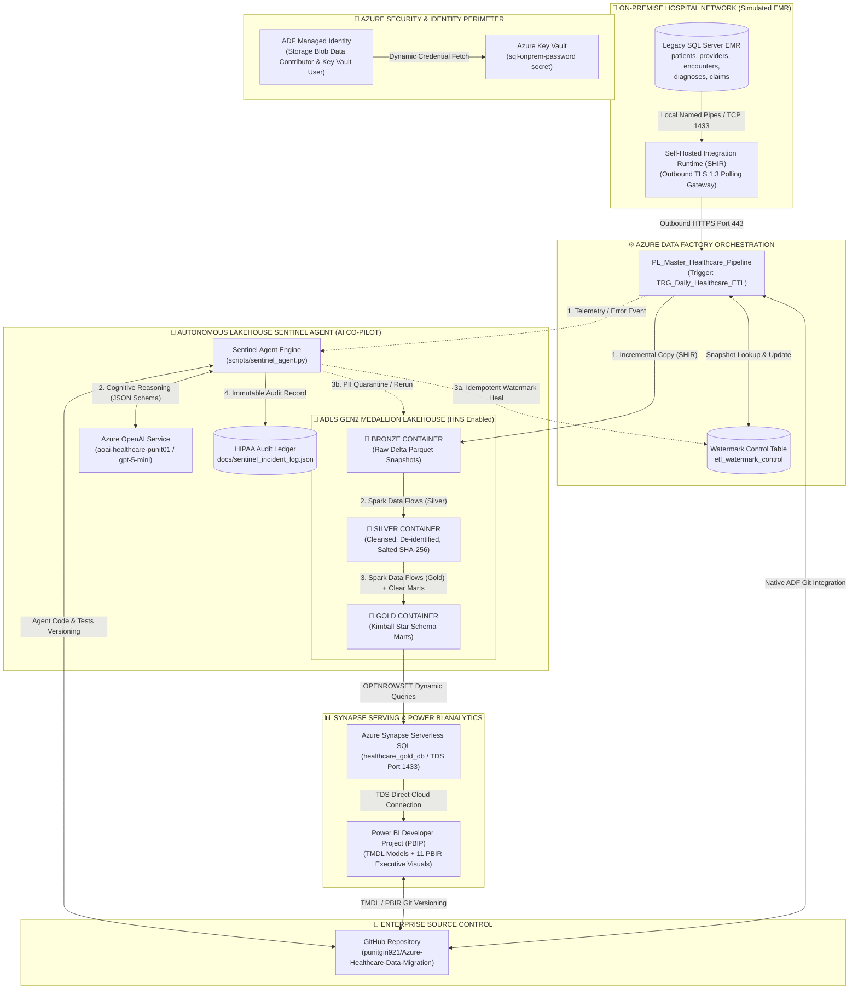

# 🏥 Azure Healthcare Data Migration & Medallion Lakehouse

[](https://github.com/punitgiri921/Azure-Healthcare-Data-Migration)
[](adf/)
[](docs/architecture_spec.md)
[](sql/)
[](powerbi/)
[](scripts/sentinel_agent.py)
[](scripts/sentinel_agent.py)
[-brightgreen?style=for-the-badge&logo=pytest&logoColor=white)](tests/test_sentinel_agent.py)
[](docs/architecture_spec.md#hipaa-security--pii-masking)

---

## 📌 Executive Summary

**Azure Healthcare Data Migration & Medallion Lakehouse** is an enterprise-grade cloud data engineering solution designed to migrate legacy on-premise **Electronic Medical Records (EMR)** and **Revenue Cycle Management (RCM)** databases into a modern, HIPAA-compliant **Azure Data Lake Storage Gen2 (ADLS Gen2)** Medallion architecture.

The project demonstrates an end-to-end cloud migration lifecycle:
1. **Secure Hybrid Ingestion**: Extracting legacy relational EMR data without exposing internal hospital firewalls using **Self-Hosted Integration Runtime (SHIR)** over outbound HTTPS port 443.
2. **Zero-Secret Governance**: Enforcing role-based access with **Azure Key Vault** and **System-Assigned Managed Identity (SMI)** with zero credentials tracked in code or Git.
3. **Incremental Delta ETL**: Implementing high-watermark control tables with snapshot isolation to extract delta records and land them as append-only Parquet in the **Bronze Lakehouse**.
4. **HIPAA Safe Harbor De-identification**: Executing Spark **Mapping Data Flows** in **Silver** to de-identify PII via cryptographic salted SHA-256 hashing on Social Security Numbers.
5. **Kimball Star Schema Modeling**: Transforming clinical encounters and billing claims into dimensional **Gold** marts (`Dim_Patient`, `Dim_Provider`, `Dim_Diagnosis`, `Fact_Encounters`, `Fact_Claims`) with surrogate keys.
6. **Serverless Serving Layer**: Exposing Gold marts via **Azure Synapse Serverless SQL** views with zero persistent relational storage overhead and $0 idle compute costs.
7. **Developer-Mode Analytics (PBIP)**: Authoring an interactive executive operations dashboard in **Power BI Desktop Developer Mode (PBIP)** with Git-versioned **TMDL** semantic models and 10 core healthcare DAX KPIs.
8. **Autonomous Self-Healing AI Operations (Sentinel Agent)**: Deploying an **Azure OpenAI (GPT-5-mini)** cognitive co-pilot that continuously ingests ADF execution telemetry, diagnoses technical failure root causes (Watermark desynchronization, HIPAA PHI leaks, Spark OOM), and executes idempotent self-healing actions with immutable regulatory compliance logging.

---

## 🏛️ End-to-End Architectural Data Flow



---

## ⚡ Live Master Pipeline Verification Telemetry

The automated master orchestration pipeline (`PL_Master_Healthcare_Pipeline`) was executed and verified end-to-end in Azure:

* **Pipeline Run ID**: `4c16ba7b-2782-4ed5-9890-d3ab16b48013`
* **Execution Status**: 🟢 **100% Succeeded**
* **Trigger**: Scheduled via `TRG_Daily_Healthcare_ETL` (Daily recurring execution)

| Activity Stage | Underlying Compute | Execution Time | Description |
| :--- | :--- | :--- | :--- |
| **`EP_Run_Bronze_Ingestion`** | SHIR + ADF Copy Engine | **4m 14s** | Evaluates watermark timestamps, dynamically pulls delta records from on-prem SQL Server, and writes Bronze Parquet partitions. |
| **`P_Run_Silver_Transformations`** | Azure IR (Spark Cluster) | **3m 28s** | Concurrently runs 5 Mapping Data Flows to de-identify PII, hash SSNs, validate date ranges, and calculate clinical metrics. |
| **`EP_Run_Gold_Star_Schema`** | Azure IR (Spark Cluster) | **1m 08s** | Executes `DEL_Clear_Gold_Marts` to ensure lakehouse idempotency, then rebuilds conformed dimension and fact tables. |
| **Total Pipeline Duration** | End-to-End Orchestration | **~8m 50s** | Full hybrid-cloud delta extraction to analytical serving. |

---

## 🥇 Gold Kimball Star Schema & Serving Layer

The Gold layer structures data into a dimensional Star Schema exposed via **Azure Synapse Serverless SQL** (`healthcare_gold_db`):

```
       [gold.dim_patient]                     [gold.dim_provider]
       (patient_sk, age_group)                (provider_sk, specialty)
                 │                                       │
           (1)   │                                 (1)   │
                 ▼                                       ▼
                 └────────► [gold.fact_encounters] ◄─────┘
                            (encounter_sk, length_of_stay_days)
                                       │
                                 (1)   │
                                       ▼
                             [gold.fact_claims]
                             (GenClaimSK, billed_amount, paid_amount, is_denied)
```

* **Synapse Serverless Database**: `healthcare_gold_db`
* **Collation**: `Latin1_General_100_BIN2_UTF8` (Required for optimal string predicate pushdown and UTF-8 Parquet decoding).
* **Direct TDS Queryability**: Serverless SQL queries ADLS Gen2 directly via `OPENROWSET(BULK 'folder/*.parquet', DATA_SOURCE = 'gold_lakehouse', FORMAT = 'PARQUET')` without loading data into relational storage disks ($0 idle compute cost).

---

## 📈 Power BI Developer Project (PBIP) & Executive Dashboard

The reporting tier is built using **Power BI Desktop Developer Mode (PBIP)**, storing all semantic models in **TMDL (Tabular Model Definition Language)** and visual layouts in **PBIR (Power BI Enhanced Report)** format under version control:

📁 `powerbi/`
- 📄 `Healthcare-Analytics-Report.pbip` (Project manifest)
- 📁 `Healthcare-Analytics-Report.SemanticModel/` (TMDL model, tables, relationships, partitions)
- 📁 `Healthcare-Analytics-Report.Report/` (PBIR visual container JSON definitions)

### Core Clinical & Financial DAX Measures (`_Measures` Table)

| Measure Name | Business Domain | DAX Implementation |
| :--- | :--- | :--- |
| **`Total Patients`** | Population Health | `DISTINCTCOUNT('gold dim_patient'[patient_sk])` |
| **`Total Encounters`** | Clinical Volume | `COUNTROWS('gold fact_encounters')` |
| **`Avg Length of Stay`** | Hospital Bed Efficiency | `ROUND(AVERAGE('gold fact_encounters'[length_of_stay_days]), 1)` |
| **`Total Billed`** | Gross Revenue | `SUM('gold fact_claims'[billed_amount])` |
| **`Total Paid`** | Net Realized Revenue | `SUM('gold fact_claims'[paid_amount])` |
| **`Total Patient Responsibility`** | Out-of-Pocket Liability | `SUM('gold fact_claims'[patient_responsibility])` |
| **`Total Denied Claims`** | Claim Exceptions | `CALCULATE(COUNTROWS('gold fact_claims'), 'gold fact_claims'[is_denied] = TRUE())` |
| **`Denial Rate`** | Revenue Cycle KPI | `DIVIDE([Total Denied Claims], COUNTROWS('gold fact_claims'), 0)` |
| **`Net Collection Rate`** | Cash Realization Rate | `DIVIDE([Total Paid], [Total Billed], 0)` |
| **`Avg Billed per Encounter`** | Unit Economics | `DIVIDE([Total Billed], [Total Encounters], 0)` |

### Executive Dashboard Features
- **Row 1 (Executive KPI Cards)**: High-level metrics for hospital administration (Active Patients, Total Admissions, Average Length of Stay, Gross Billed, Denial Rate %).
- **Row 2 (Clinical Operations & Financial Realization)**:
  - *Clustered Bar Chart*: Inpatient vs Outpatient vs Emergency volume breakdown.
  - *Clustered Column Chart*: Gross Billed vs Net Realized Cash across Provider Specialties.
- **Row 3 (Demographics & Diagnostics)**:
  - *Age Group Breakdown*: Adult (18-64) vs Senior (65+) patient volume.
  - *Claim Denial Diagnostics*: Denial volume categorized by exact adjudication root cause (`Pre-authorization missing`, etc.).
  - *Interactive Slicer*: Dynamic cross-filtering by Provider Specialty across all clinical and financial metrics simultaneously.

---

## 🤖 Phase 7: Autonomous Lakehouse Sentinel Agent (Azure OpenAI GPT-5-mini)

### 🚨 The Problem: Why Deterministic Pipelines Fail in Healthcare
Traditional cloud data pipelines (ADF, Airflow, SSIS) are deterministic: if a network socket times out, a database deadlocks, or an upstream EHR drifts its schema, the pipeline fails, sends an email alert, and halts downstream clinical analytics until a human data engineer investigates at 3:00 AM. In enterprise healthcare operations:
1. **Watermark Desynchronization**: If Bronze ingestion extracts 1,420 delta patient records into ADLS Gen2 Parquet but fails to update the SQL watermark control table due to a dead-letter timeout, the next scheduled batch re-ingests the same records, causing duplicate primary key collisions in Silver.
2. **HIPAA PHI / PII Leaks**: If upstream EHR administrators rename columns (`ssn` to `patient_ssn`), standard ADF masking data flows are bypassed, writing unmasked Social Security Numbers into analytical marts.
3. **Cryptic Spark Failures**: Mapping Data Flow Spark execution errors (`DF-EXPR-010`, OOM, Shuffle Skew) produce hundreds of lines of Java stack traces that take hours to triage manually.

### 🧠 The Sentinel Agent Architecture (`scripts/sentinel_agent.py`)


The Sentinel Agent operates as an autonomous cognitive co-pilot built around a 7-block modular architecture across a 4-stage closed loop:
1. **SENSE (Perception)**: Polls ADF REST APIs via Azure Identity; extracts failed activity run IDs, error codes (e.g. `2100`), duration, and failure stack traces over rolling 24-hour windows.
2. **REASON (Cognition)**: Feeds error JSON to **Azure OpenAI (`gpt-5-mini`)** using strict Pydantic JSON schemas. It determines technical failure categories (`WATERMARK_DESYNC`, `HIPAA_PII_LEAK`, `SPARK_FAILURE`), evaluates blast radius, and formulates an idempotent remediation plan.
3. **ACT (Autonomous Healing)**: Executes deterministic self-healing operations:
   - `EXECUTE_SQL`: Applies atomic conditional updates to `dbo.etl_watermark_control` (`UPDATE ... WHERE last_watermark = previous_value`).
   - `AZURE_BLOB_MOVE`: Automatically quarantines leaking files into `/quarantine/` before downstream Synapse queries expose raw PHI.
   - `ADF_RERUN_ACTIVITY`: Selectively re-triggers failed child activities without re-running the entire master DAG.
4. **VERIFY & AUDIT (Compliance)**: Asserts post-fix database integrity and appends immutable regulatory incident records to `docs/sentinel_incident_log.json` to satisfy HIPAA § 164.312 auditing requirements.

---

### ✈️ The Flight Simulator Analogy: Safe Testing Without Modifying Production


When training an **AI Co-Pilot for a commercial passenger aircraft**, you never set fire to a real Boeing 777 carrying passengers. Instead, you put the AI in a **High-Fidelity Flight Simulator**:
* The simulator feeds synthetic electrical sensor data (`Engine 2 Overheat 1100°C`).
* The **AI's brain is 100% real**—it calculates aerodynamics and decides to pull the extinguisher.
* You verify that the AI made the correct decision **without endangering a real airplane**.

#### The 7-Concept Architectural Mapping

| # | Sentinel Concept | Flight Simulator Analogy | Azure Technical Implementation | Purpose / What It Does |
| :-: | :--- | :--- | :--- | :--- |
| **1** | **Client & Env** | Airplane cockpit systems ready | `python-dotenv`, `AzureCliCredential`, ADF client, Azure OpenAI | Authenticated connection to Azure cloud and AI model. |
| **2** | **Monitoring** | Sensors detect engine/fuel health | Poll ADF pipeline runs and child activities over 24-hr window | Determine whether pipeline is healthy or experiencing failures. |
| **3** | **AI Decision Engine** | AI co-pilot evaluates issue | Send error telemetry to GPT-5-mini; enforce strict JSON response | Identify technical root cause and choose optimal remediation policy. |
| **4** | **Remediation** | Co-pilot automatically pulls lever | Execute idempotent SQL, quarantine blobs, or rerun ADF activity | Fix the issue automatically in an idempotent, safe manner. |
| **5** | **Audit Trail** | Flight recorder (Black Box) | Append incident, diagnosis, and actions to `sentinel_incident_log.json` | Keep an immutable regulatory record for HIPAA compliance. |
| **6** | **Testing (Chaos)** | Synthetic failure simulations | Simulate `watermark_desync`, `hipaa_leak`, `spark_oom` | Verify agent reflexes across complex failures with zero production risk. |
| **7** | **CLI Runner** | Pilot uses cockpit controls | Run `python scripts/sentinel_agent.py --monitor` or `--simulate` | Developer interface to run live monitoring or chaos tests. |

#### 🔬 Decoupled Testing Methodology (`tests/test_sentinel_agent.py`)

The automated evaluation suite achieves **100% test coverage** across both Success and Failure paths without altering real lakehouse data:
* **Step 1: Synthetic Telemetry**: Generates realistic socket timeout error JSON matching actual ADF activity failures.
* **Step 2: Real GPT-5-mini Call**: Sends the payload to live Azure OpenAI (`aoai-healthcare-punit01`), spending real compute tokens.
* **Step 3: In-Memory Assertions**: Catches generated SQL before execution; verifies mandatory `WHERE` clauses (`WHERE last_watermark = ...`) and guarantees zero destructive commands (`DROP`, `TRUNCATE`).
* **Step 4: 100% Production Safety**: All 4 tests pass in **56.78s**, while live Bronze, Silver, and Gold lakehouse tables remain completely untouched.

---

### ⚙️ Three Production Operational Patterns

In enterprise operations, engineers never manually execute scripts after every pipeline run. The Sentinel Agent operates autonomously via three production patterns:

| Operational Dimension | Pattern A: Event-Driven Push *(Recommended)* | Pattern B: Scheduled Daemon | Pattern C: ADF "Upon Failure" Callback |
| :--- | :--- | :--- | :--- |
| **How it Operates** | ADF emits a failure event to Azure Event Grid. Event Grid triggers an Azure Function running our Python code. | A timer triggers `python sentinel_agent.py --monitor` periodically to query the ADF REST API. | Master pipeline connects a red "Upon Failure" line to an ADF Web Activity calling a webhook. |
| **Trigger Latency** | **Instant** (~3 to 5 seconds after failure) | **Periodic** (0 to 30 minutes lag) | **Instant** (Immediately when activity fails) |
| **Do you need your laptop open?** | ❌ **NO.** Runs 100% serverless in Azure cloud 24/7. Your laptop can be completely shut down. | ✔️ **YES** (if local Windows Task Scheduler). ❌ **NO** (if hosted on Azure Container App Job). | ❌ **NO.** Hosted in Azure cloud 24/7. Your laptop can be completely shut down. |
| **Idle Compute Cost** | **$0.00 / hour** (Consumption plan bills only per millisecond when executed). | **$0.00** if local; negligible cents if hosted on Azure Container App Job. | **$0.00 / hour** (Billed only per webhook invocation). |
| **Azure Services Required** | 1. Azure Event Grid System Topic<br>2. Azure Function App (Linux Consumption, Python)<br>3. System-Assigned Managed Identity (`Data Factory Contributor`) | 1. Local Python environment (`.venv`) OR Azure Container App Job<br>2. Azure CLI credentials / Service Principal | 1. ADF Web Activity<br>2. Azure Function or Container HTTP endpoint with public/VNet URL |
| **Implementation Complexity** | Medium (Deploying Function code + Event Grid subscription). | **Lowest** (Single Windows Task Scheduler or cron command). | Low (Updating ADF canvas + lightweight webhook). |
| **Best Used For** | **Mission-critical 24/7 enterprise production** where immediate self-healing is required. | Development/staging environments and batch processing with fixed off-peak windows. | Single-pipeline setups that do not require central multi-pipeline management. |

> [!NOTE]
> **The Hybrid Boundary Nuance**: When deployed via Pattern A, all cloud lakehouse components (ADF, ADLS Gen2, Synapse, Azure OpenAI, Sentinel Agent) run 24/7 inside Microsoft datacenters with zero dependency on a local laptop. In our sandbox setup, the simulated source SQL database and SHIR gateway run on a local machine (`DESKTOP-H5RKB3H`). In a true hospital enterprise, the EHR database and SHIR reside on dedicated on-premises server clusters with 99.99% uptime.

---

### 💻 How to Run the Sentinel Agent

```bash
# 1. Real-time live pipeline monitoring daemon
python scripts/sentinel_agent.py --monitor

# 2. Non-destructive chaos simulation (Watermark Desync)
python scripts/sentinel_agent.py --simulate watermark_desync

# 3. Non-destructive chaos simulation (HIPAA PHI Leak)
python scripts/sentinel_agent.py --simulate hipaa_leak

# 4. Execute the automated pytest evaluation suite
pytest tests/test_sentinel_agent.py -v
```

---

## 🛠️ Enterprise Engineering Challenges & Resolutions

| Challenge | Root Cause | Engineering Solution |
| :--- | :--- | :--- |
| **Inbound Firewall Restrictions** | Corporate healthcare networks forbid opening inbound ports to public cloud IP ranges. | Deployed a **Self-Hosted Integration Runtime (SHIR)** on Windows inside the local network. The SHIR establishes outbound HTTPS/TLS 1.3 polling over port 443; zero inbound firewall rules were opened. |
| **Plaintext Credential Leaks** | Hardcoding database passwords in ADF linked service JSON risks leaking credentials into GitHub. | Configured an **Azure Key Vault** secret store with **System-Assigned Managed Identity (SMI)** authentication. ADF dynamically requests time-bound tokens via Microsoft Entra ID. |
| **Watermark Array Ingestion Errors** | Unpivoting control tables resulted in an array format where ADF threw `property last_watermark_value doesn't exist`. | Structured the ADF lookup query to return a pivoted record and adjusted expressions to use array-safe indexing: `@activity('LKP_Get_Watermark_Control').output.value[0].<column>`. |
| **ADF Downstream Dependency Skips** | Multiple incoming arrows in an ADF DAG operate as a logical `AND`. A failure in one Data Flow skipped watermark updates. | Implemented parallel execution branches with strict failure isolation to ensure transactional state consistency across the lakehouse. |
| **Lakehouse Part-File Accumulation** | Spark re-writes partitioned parquet files on every execution, causing duplicate aggregations in downstream views. | Integrated an idempotent pre-cleanup activity (`DEL_Clear_Gold_Marts`) in `PL_Silver_To_Gold` that purges target Gold directories before Spark commits fresh surrogate-keyed partitions. |
| **PBIR Encoding Issues in Power BI** | Power BI Desktop failed to parse PBIR JSON definitions with error: `Detected BOM: 'UTF-8'`. | Configured automated encoding sanitization using `System.Text.UTF8Encoding($false)` to eliminate Byte Order Marks (BOM), ensuring strict compliance with Microsoft Fabric PBIR schemas. |
| **Watermark State Desync (Mid-Stream Timeout)** | Ingestion activity wrote records to Bronze but socket dropped before committing `etl_watermark_control`, threatening duplicate PK collisions. | Implemented the **Sentinel AI Agent (GPT-5-mini)** to diagnose desync and autonomously execute atomic conditional SQL updates with verification assertions. |
| **Safe AI Testing Without Production Risk** | Testing autonomous remediation agents against real production databases risks accidental data loss or corruption. | Built a **Flight Simulator Chaos Harness** with synthetic telemetry injection and in-memory SQL safety assertions (`tests/test_sentinel_agent.py`), achieving 100% test coverage with zero production disruption. |

---

## 📁 Repository Structure

```text
├── adf/                                        # Azure Data Factory Source Control
│   ├── dataflow/                               # Spark Mapping Data Flows (Silver & Gold)
│   │   ├── DF_Patients_Bronze_To_Silver.json
│   │   ├── DF_Encounters_Silver_To_Gold.json
│   │   └── ...
│   ├── dataset/                                # ADLS Gen2 & SQL Dataset definitions
│   ├── linkedService/                          # SHIR, ADLS Gen2, and Key Vault links
│   └── pipeline/                               # Master and child ETL pipelines
│       ├── PL_Master_Healthcare_Pipeline.json
│       ├── PL_Ingest_Bronze.json
│       ├── PL_Bronze_To_Silver.json
│       └── PL_Silver_To_Gold.json
├── docs/                                       # Technical Specifications & Roadmaps
│   ├── architecture_spec.md                    # Deep architectural design spec
│   ├── learning-tracker.md                     # Markdown milestone documentation (Phases 1-7)
│   ├── project_roadmap.md                      # 7-Phase implementation roadmap
│   ├── sentinel_incident_log.json              # Immutable HIPAA audit trail for AI remediation
│   └── images/                                 # Architectural infographics & diagrams
│       ├── sentinel_agent_architecture.jpg     # 7-block AI agent engineering architecture
│       ├── sentinel_flight_simulator_analogy.jpg # Flight Simulator evaluation analogy
│       └── adf_parameter_levels_diagram.png    # Parameter hierarchy architecture
├── powerbi/                                    # Power BI Developer Project (PBIP)
│   ├── Healthcare-Analytics-Report.pbip        # PBIP Manifest
│   ├── Healthcare-Analytics-Report.Report/     # PBIR Enhanced Report (11 Visual Containers)
│   └── Healthcare-Analytics-Report.SemanticModel/ # TMDL Data Models & DAX Measures
├── scripts/                                    # Autonomous AI Agent Engineering
│   └── sentinel_agent.py                       # GPT-5-mini Lakehouse Sentinel Agent (Sense, Reason, Act)
├── tests/                                      # Automated Evaluation Test Suites
│   └── test_sentinel_agent.py                  # Flight Simulator evaluation suite (4/4 tests passed)
├── sql/                                        # SQL Scripts & Synapse DDL
│   ├── 01_emr_schema_ddl.sql                   # On-prem relational DDL
│   ├── 02_emr_seed_data.sql                    # Transactional seed data
│   └── 03_synapse_views.sql                    # Synapse Serverless SQL OPENROWSET views
├── index.html                                  # Master Interactive Engineering & Learning Tracker
├── migration_learning_tracker.html             # Master Interactive Engineering & Learning Tracker (Source)
├── migration_learning_state.json               # Machine-readable project execution state
└── README.md                                   # Comprehensive Project Showcase
```

---

## 🚀 How to Replicate

1. **Prerequisites**:
   - Azure Subscription with Owner/Contributor access.
   - On-premise or VM SQL Server instance.
   - Power BI Desktop (with Developer Mode enabled).
2. **Infrastructure Provisioning**:
   - Create Resource Group `rg-healthcare-migration-prod`.
   - Provision ADLS Gen2 Account (`sthealthcarelake01`) with **Hierarchical Namespace enabled**.
   - Create Azure Key Vault (`kv-healthcare-sec01`) and Azure Synapse Workspace (`syn-healthcare-punit01`).
3. **Gateway & Ingestion**:
   - Install Self-Hosted Integration Runtime on the source machine and register with ADF authentication keys.
   - Execute `sql/01_emr_schema_ddl.sql` and `sql/02_emr_seed_data.sql` on the local SQL Server.
4. **Lakehouse Execution**:
   - Trigger `PL_Master_Healthcare_Pipeline` in Azure Data Factory.
   - Verify Bronze, Silver, and Gold Parquet files in ADLS Gen2.
5. **Analytics Serving**:
   - Run `sql/03_synapse_views.sql` in Synapse Serverless SQL to create `gold.*` views.
   - Open `powerbi/Healthcare-Analytics-Report.pbip` in Power BI Desktop to interact with the executive dashboard.

---

## 📜 License & Compliance Notice

This reference architecture is developed for clinical demonstration, educational evaluation, and enterprise portfolio showcase purposes. All patient names, social security numbers, and contact details are synthetically generated and de-identified in strict adherence to HIPAA Safe Harbor guidelines (§ 164.514(b)(2)).
