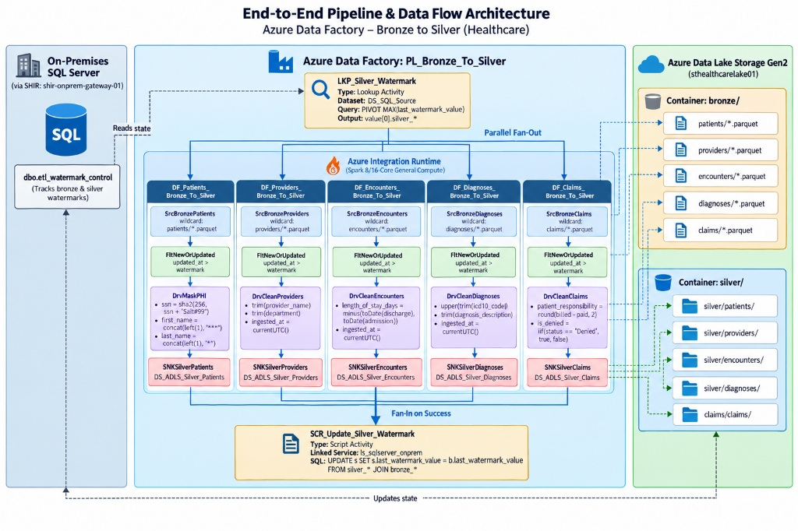
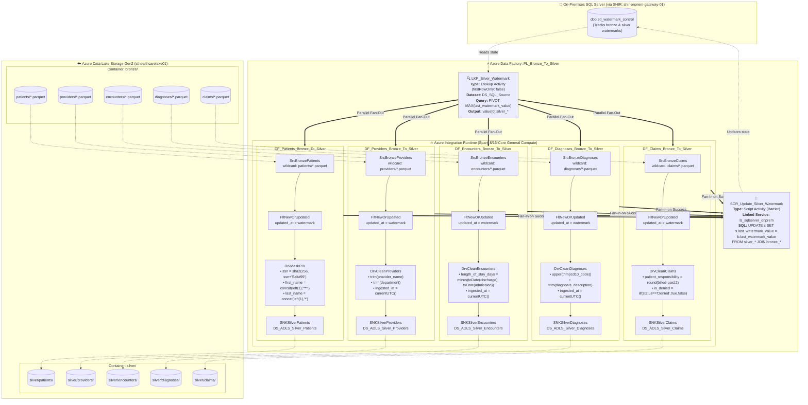
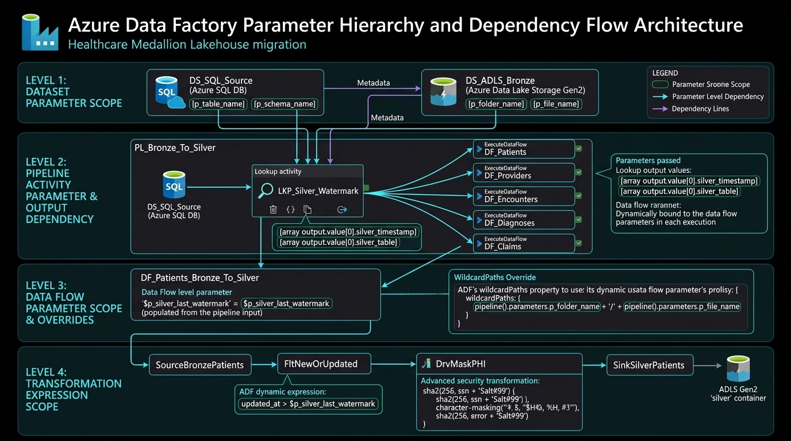

# Technical Architecture Specification: Azure Healthcare Data Migration

---

## 1. Business Context & Objective
- **Organization**: Apex Regional Health System (Fictional Enterprise).
- **Core Challenge**: Legacy on-prem EMR database suffers from night-time query contention during financial reporting, lacks regulatory data masking for general analytics, and cannot scale for clinical ML models.
- **Solution**: Cloud data migration to an ADLS Gen2 Medallion Lakehouse powered by Azure Data Factory, Synapse Serverless SQL, and Power BI.

---

## 2. Core Entities & Schema Design

### On-Premises Source Tables
1. `patients` (`patient_id`, `first_name`, `last_name`, `ssn`, `dob`, `gender`, `address`, `city`, `state`, `zip`, `insurance_id`, `created_at`, `updated_at`)
2. `providers` (`provider_id`, `provider_name`, `specialty`, `department`, `npi_number`, `created_at`, `updated_at`)
3. `encounters` (`encounter_id`, `patient_id`, `provider_id`, `admission_date`, `discharge_date`, `encounter_type`, `department`, `discharge_disposition`, `created_at`, `updated_at`)
4. `diagnoses` (`diagnosis_id`, `encounter_id`, `icd10_code`, `diagnosis_description`, `is_primary`, `created_at`, `updated_at`)
5. `claims` (`claim_id`, `encounter_id`, `billed_amount`, `paid_amount`, `claim_status`, `denial_reason`, `submitted_date`, `paid_date`, `created_at`, `updated_at`)

### Watermark Control Table
```sql
CREATE TABLE etl_watermark_control (
    table_name VARCHAR(100) PRIMARY KEY,
    watermark_column VARCHAR(100),
    last_watermark_value TIMESTAMP,
    status VARCHAR(50),
    last_run_timestamp TIMESTAMP
);
```

---

## 3. HIPAA Security & PII Masking Architecture
- **In-Flight Encryption**: TLS 1.3 / HTTPS across SHIR gateway and Azure backplane.
- **At-Rest Encryption**: Azure Storage Service Encryption (SSE) with Microsoft-managed keys.
- **PII De-identification**: 
  - `ssn` -> Hashed via SHA-256 (`sha2(256, ssn)`).
  - `patient_name` -> Encrypted or pseudonymized into `patient_surrogate_key`.
  - Date of Birth -> Truncated to birth year or age bracket in Silver/Gold.


---

## 4. Medallion Layer Specifications

| Layer | Format | Partitioning | Cleaning & Transformation Rules |
| :--- | :--- | :--- | :--- |
| **Bronze** | Raw Parquet | `bronze/{table}/year={yyyy}/month={MM}/` | Raw append-only capture. Ingestion metadata added (`_ingestion_timestamp`, `_source_file`). |
| **Silver** | Delta / Clean Parquet | `silver/{table}/` | Schema enforcement, null value handling, SHA-256 PII masking, deduplication on primary keys. |
| **Gold** | Delta Star Schema | `gold/{dim_or_fact}/` | Conformed Dimensions (`Dim_Patient`, `Dim_Provider`, `Dim_Diagnosis`, `Dim_Date`) and Fact tables (`Fact_Encounters`, `Fact_Claims`). |

---

## 5. Budget & Cost Allocation ($200 Trial)
- Estimated monthly burn: **~$15 – $25**.
- Data Factory Mapping Data Flow compute: Set cluster Time-To-Live (TTL) to 10 minutes to eliminate idle cluster charges.
- Synapse Serverless SQL: Billed strictly on data scanned (~$5 per TB); our test datasets scan under 1 GB total (< $0.05).

---

## 6. Phase 4 Medallion Silver Lakehouse Transformation & Orchestration Architecture

### 6.1 End-to-End Pipeline & Data Flow Architecture





---

### 6.2 Parameter Hierarchy, Dependencies & Execution Scopes



Azure Data Factory enforces a strict 4-level parameter scope hierarchy. Parameters are passed from macro orchestration scopes into micro execution and transformation scopes:

```text
┌─────────────────────────────────────────────────────────────────────────────────────────────┐
│ LEVEL 1: DATASET PARAMETERS (Static Blueprint Scope)                                        │
│ • DS_SQL_Source: @parameters.p_table_name                                                   │
│ • DS_ADLS_Bronze: @parameters.p_folder_name, @parameters.p_file_name                        │
└──────────────────────────────────────────────┬──────────────────────────────────────────────┘
                                               │ Bound at pipeline canvas
┌──────────────────────────────────────────────▼──────────────────────────────────────────────┐
│ LEVEL 2: PIPELINE ACTIVITY PARAMETER & OUTPUT BINDINGS (Orchestration Scope)                │
│ • LKP_Silver_Watermark feeds dataset param: p_table_name = 'etl_watermark_control'          │
│ • Emits dynamic JSON array: @activity('LKP_Silver_Watermark').output.value[0].<col>         │
│ • ExecuteDataFlow activities pass 'dummy' to dataset params & dynamically inject watermarks │
└──────────────────────────────────────────────┬──────────────────────────────────────────────┘
                                               │ Injected into Spark execution payload
┌──────────────────────────────────────────────▼──────────────────────────────────────────────┐
│ LEVEL 3: DATA FLOW PARAMETERS & OVERRIDES (Spark Job Scope)                                 │
│ • Defined in Data Flow Settings: $p_silver_last_watermark (default: '1970-01-01 00:00:00')   │
│ • Wildcard Override: wildcardPaths: ['<entity>/*.parquet'] bypasses dataset file parameters │
└──────────────────────────────────────────────┬──────────────────────────────────────────────┘
                                               │ Evaluated in row-by-row expressions
┌──────────────────────────────────────────────▼──────────────────────────────────────────────┐
│ LEVEL 4: TRANSFORMATION EXPRESSIONS (Engine Row Scope)                                      │
│ • Filter: updated_at > toTimestamp(replace(replace($p_silver_last_watermark,'T',' '),'Z',''))│
│ • Derived Column: sha2(256, concat(ssn, 'Salt#99')), substring masking, length_of_stay     │
└─────────────────────────────────────────────────────────────────────────────────────────────┘
```

#### Parameter Dependency & Traceability Matrix

| Parameter Name | Scope Level | Declared In | Supplied By / Bound At | Consumed In | Function / Purpose |
| :--- | :--- | :--- | :--- | :--- | :--- |
| `p_table_name` | **Level 1: Dataset** | `DS_SQL_Source` | Pipeline Canvas (`LKP_Silver_Watermark`) | `dbo.@dataset().p_table_name` | Makes SQL dataset generic for any table |
| `p_folder_name` | **Level 1: Dataset** | `DS_ADLS_Bronze` | Pipeline Canvas (`ExecuteDataFlow`) | `bronze/@dataset().p_folder_name/` | Generic folder pointer (Satisfied with `'dummy'` in Data Flow) |
| `p_file_name` | **Level 1: Dataset** | `DS_ADLS_Bronze` | Pipeline Canvas (`ExecuteDataFlow`) | `@dataset().p_file_name` | Generic file pointer (Satisfied with `'dummy'` in Data Flow) |
| `output.value[0].*` | **Level 2: Activity Output** | `LKP_Silver_Watermark` | SQL Server PIVOT Query | `ExecuteDataFlow` Parameters tab | Dynamically extracts entity-specific high-watermark timestamp |
| `p_silver_last_watermark` | **Level 3: Data Flow** | All 5 Data Flows | Pipeline Canvas `parameters` setting | Data Flow Filter Transformation | Spark job parameter carrying upper boundary of previously processed delta |
| `wildcardPaths` | **Level 3: Data Flow Source** | Data Flow Source | Data Flow Source Options | Spark Parquet Reader | Overrides dataset file parameters to glob all incremental part files |
| `$p_silver_last_watermark` | **Level 4: Transformation** | Filter Expression | Spark Expression Engine | `FltNewOrUpdated` | Row filter stripping `'T'`/`'Z'` and comparing `updated_at > watermark` |
| `Salt#99` | **Level 4: Security Masking** | Derived Column | `DrvMaskPHI` Expression | Spark Cryptographic Hash | Cryptographic salt defeating Rainbow Table attacks under HIPAA |

---

### 6.3 Datasets & Storage Topology Matrix

| Dataset Name | Type | Linked Service | Container / Folder | Parameters | Purpose |
| :--- | :--- | :--- | :--- | :--- | :--- |
| `DS_SQL_Source` | SqlServerTable | `ls_sqlserver_onprem` | Database: `healthcare_emr_source` | `p_table_name` (string) | Parameterized source for control table queries |
| `DS_ADLS_Bronze` | Parquet (Snappy) | `ls_adls_healthcare` | Container: `bronze` | `p_folder_name`, `p_file_name` | Parameterized reader for raw Bronze parquet files |
| `DS_ADLS_Silver_Patients` | Parquet (Snappy) | `ls_adls_healthcare` | Container: `silver/patients/` | *None* | Target sink for clean, HIPAA-masked patient records |
| `DS_ADLS_Silver_Providers` | Parquet (Snappy) | `ls_adls_healthcare` | Container: `silver/providers/` | *None* | Target sink for cleaned provider records |
| `DS_ADLS_Silver_Encounters` | Parquet (Snappy) | `ls_adls_healthcare` | Container: `silver/encounters/` | *None* | Target sink for clinical encounters with length of stay |
| `DS_ADLS_Silver_Diagnoses` | Parquet (Snappy) | `ls_adls_healthcare` | Container: `silver/diagnoses/` | *None* | Target sink for uppercase standardized ICD-10 codes |
| `DS_ADLS_Silver_Claims` | Parquet (Snappy) | `ls_adls_healthcare` | Container: `silver/claims/` | *None* | Target sink for enriched financial insurance claims |

### 6.3 Pipeline Orchestration & Parameter Binding Settings

- **Pipeline Name**: `PL_Bronze_To_Silver`
- **Lookup Activity (`LKP_Silver_Watermark`)**:
  - `firstRowOnly`: `false`
  - SQL Reader Query:
    ```sql
    SELECT 
        MAX(CASE WHEN table_name = 'silver_patients'   THEN last_watermark_value END) AS silver_patients,
        MAX(CASE WHEN table_name = 'silver_providers'  THEN last_watermark_value END) AS silver_providers,
        MAX(CASE WHEN table_name = 'silver_encounters' THEN last_watermark_value END) AS silver_encounters,
        MAX(CASE WHEN table_name = 'silver_diagnoses'  THEN last_watermark_value END) AS silver_diagnoses,
        MAX(CASE WHEN table_name = 'silver_claims'     THEN last_watermark_value END) AS silver_claims
    FROM dbo.etl_watermark_control;
    ```
- **Data Flow Parameter Bindings (Array Indexing)**:
  - `DF_Patients_Bronze_To_Silver`: `'@{activity(''LKP_Silver_Watermark'').output.value[0].silver_patients}'`
  - `DF_Providers_Bronze_To_Silver`: `'@{activity(''LKP_Silver_Watermark'').output.value[0].silver_providers}'`
  - `DF_Encounters_Bronze_To_Silver`: `'@{activity(''LKP_Silver_Watermark'').output.value[0].silver_encounters}'`
  - `DF_Diagnoses_Bronze_To_Silver`: `'@{activity(''LKP_Silver_Watermark'').output.value[0].silver_diagnoses}'`
  - `DF_Claims_Bronze_To_Silver`: `'@{activity(''LKP_Silver_Watermark'').output.value[0].silver_claims}'`
  - *Dataset Dummy Parameters*: `p_folder_name: 'dummy'`, `p_file_name: 'dummy'` (satisfies schema validation while runtime file globbing uses `wildcardPaths`).
- **Script Barrier Activity (`SCR_Update_Silver_Watermark`)**:
  - Linked Service: `ls_sqlserver_onprem` via SHIR gateway
  - Dependency: Requires `Succeeded` on **all 5 Data Flows** (Atomic AND barrier)
  - SQL Command:
    ```sql
    UPDATE s
    SET 
        s.last_watermark_value = b.last_watermark_value,
        s.status = 'SUCCESS',
        s.last_run_timestamp = GETDATE()
    FROM dbo.etl_watermark_control s
    JOIN dbo.etl_watermark_control b 
      ON s.table_name = 'silver_' + b.table_name
    WHERE s.table_name LIKE 'silver_%';
    ```

### 6.4 Data Flow Transformation Rules

1. **Common Watermark Filter Expression (handling ISO-8601 'T' / 'Z' strings)**:
   ```text
   isNull(updated_at) || updated_at > toTimestamp(replace(replace($p_silver_last_watermark, 'T', ' '), 'Z', ''))
   ```
2. **`DF_Patients_Bronze_To_Silver` (HIPAA Safe Harbor Compliance)**:
   - `ssn`: `sha2(256, replace(ssn, '-', ''))` *(or salted variant: `sha2(256, concat(ssn, 'Salt#99'))`)*
   - `first_name`: `concat(substring(first_name, 1, 1), '***')`
   - `last_name`: `concat(substring(last_name, 1, 1), '*')`
3. **`DF_Providers_Bronze_To_Silver`**:
   - `provider_name`: `trim(provider_name)`
   - `department`: `trim(department)`
   - `ingested_at`: `currentUTC()`
4. **`DF_Encounters_Bronze_To_Silver`**:
   - `length_of_stay_days`: `iif(isNull(discharge_date), 0, minus(toDate(discharge_date), toDate(admission_date)))`
   - `ingested_at`: `currentUTC()`
5. **`DF_Diagnoses_Bronze_To_Silver`**:
   - `icd10_code`: `trim(upper(icd10_code))`
   - `diagnosis_description`: `trim(diagnosis_description)`
   - `ingested_at`: `currentUTC()`
6. **`DF_Claims_Bronze_To_Silver`**:
   - `patient_responsibility`: `round(billed_amount - paid_amount, 2)`
   - `is_denied`: `iif(claim_status == 'Denied', true(), false())`
   - `ingested_at`: `currentUTC()`

