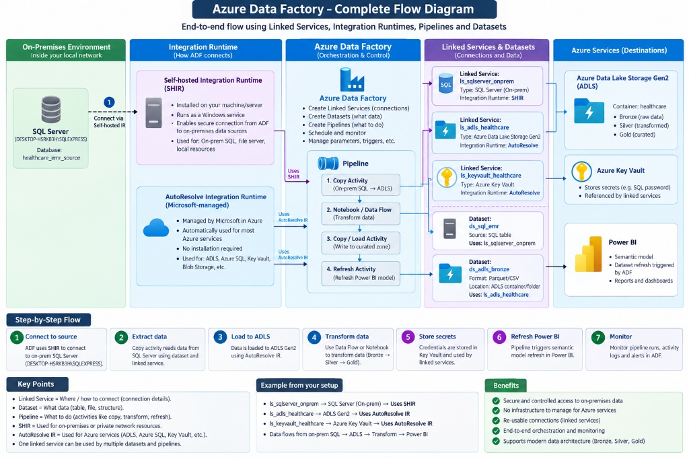
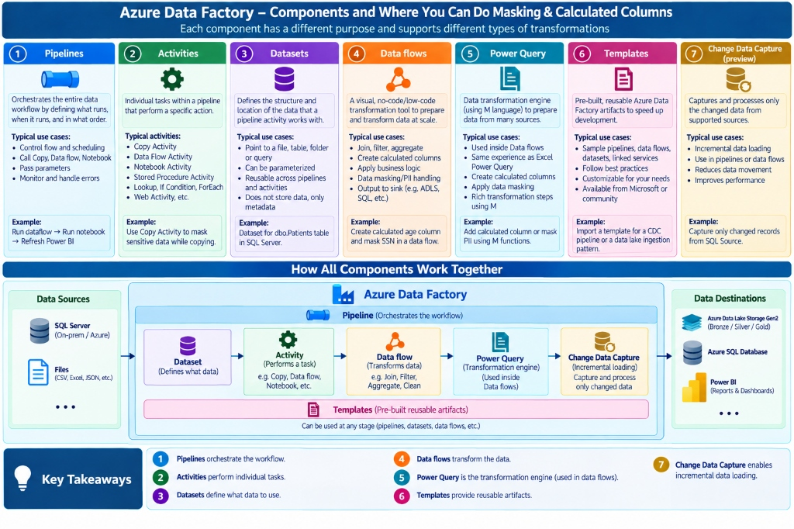
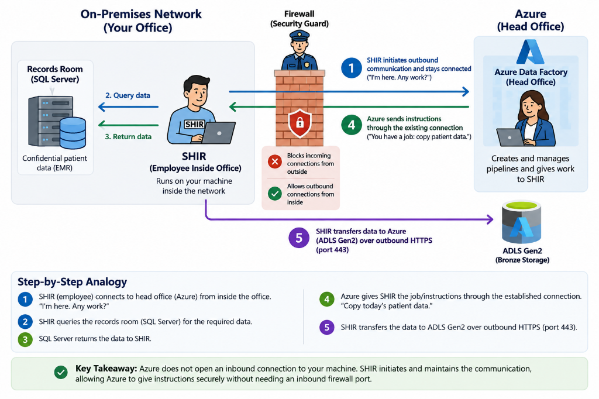
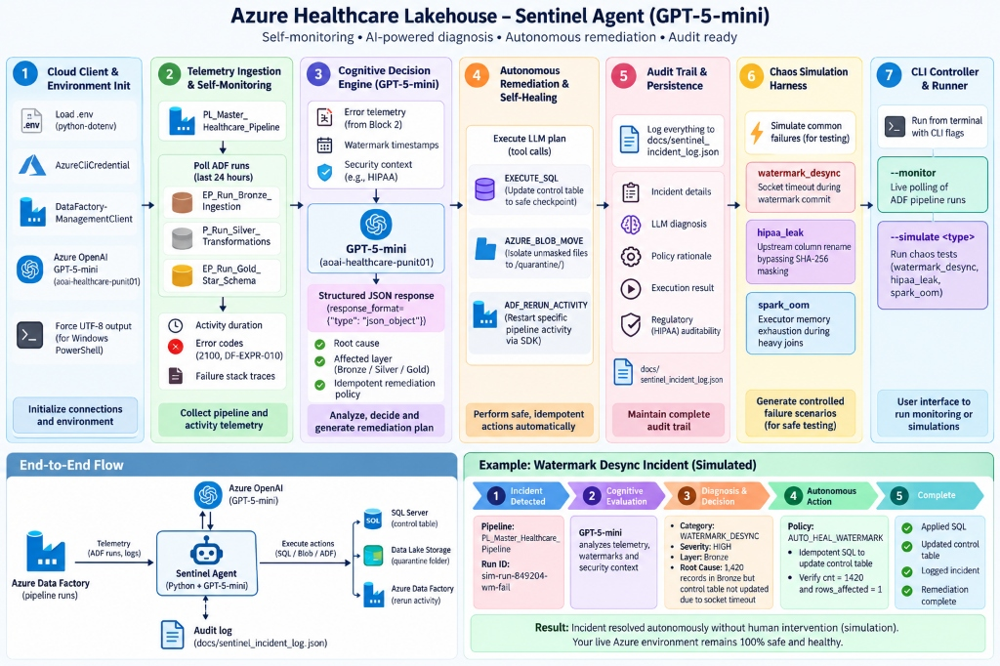
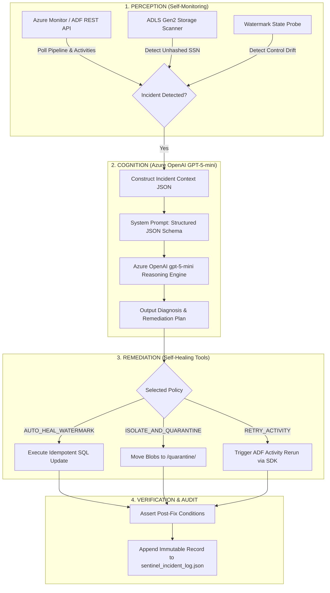
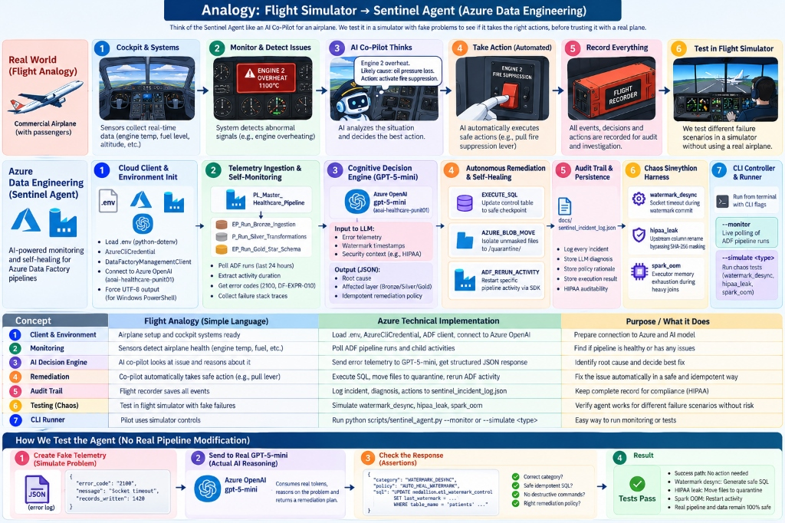
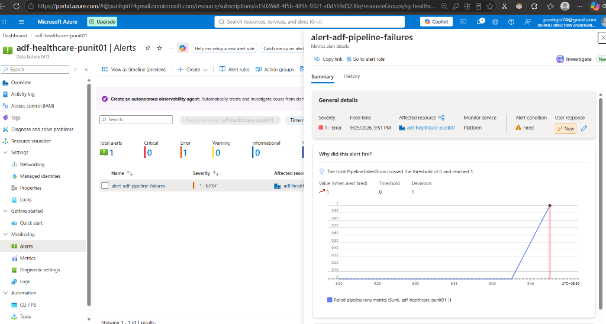
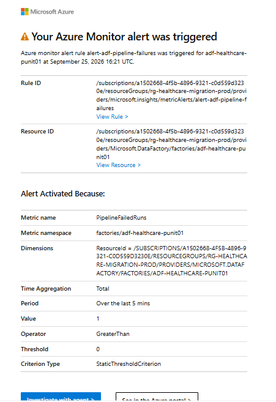

# Azure Healthcare Data Migration: Master Engineering & Learning Tracker

Welcome to the authoritative engineering ledger for the **Azure Healthcare Data Migration & Medallion Lakehouse** platform. This document tracks all architectural concepts learned, technical interview question defenses, hands-on lab evidence, and troubleshooting playbooks in strict accordance with our **Permanent Learning Rules**.

---

## 1. Project Health & Progress Matrix

| Phase ID | Phase Name | Status | Tasks Complete | Phase Gate Stage (11 Steps) | Score |
| :--- | :--- | :--- | :--- | :--- | :--- |
| **Phase 1** | **Cloud Provisioning & Zero-Secret Setup** | 🟢 **COMPLETED** | **7 / 7** | **10. PHASE COMPLETE** | **10 / 10** |
| **Phase 2** | **On-Prem Database & SHIR Gateway Setup** | 🟢 **COMPLETED** | **7 / 7** | **10. PHASE COMPLETE** | **10 / 10** |
| **Phase 3** | **Metadata-Driven Watermark Ingestion (Bronze)** | 🟢 **COMPLETED** | **8 / 8** | **10. PHASE COMPLETE** | **10 / 10** |
| **Phase 4** | **Medallion Transformations & HIPAA (Silver & Gold)** | 🟢 **COMPLETED** | **7 / 7** | **10. PHASE COMPLETE** | **10 / 10** |
| **Phase 5** | **Synapse Serverless Serving & Trigger Automation** | 🟢 **COMPLETED** | **5 / 5** | **10. PHASE COMPLETE** | **10 / 10** |
| **Phase 6** | **Power BI Reporting & CV Deliverables** | 🟢 **COMPLETED** | **5 / 5** | **10. PHASE COMPLETE** | **10 / 10** |
| **Phase 7** | **Autonomous Lakehouse Sentinel Agent (GPT-5-mini)** | 🟢 **COMPLETED** | **6 / 6** | **10. PHASE COMPLETE** | **10 / 10** |

```text
11-STEP PHASE GATE PIPELINE:
[All 6 Phases 100% Completed & Verified End-to-End] -> 10. PHASE COMPLETE
```

---

## 2. Final "AHA!" Breakthrough Principles (Rule 26)

1. **SHIR is the secure bridge** between my private SQL Server and Azure. It polls outbound on port 443; no ports are ever opened inbound.
2. **ADF orchestrates the pipeline**; it manages the schedule and coordinates data movement, but it is NOT the database or compute warehouse.
3. **Key Vault protects secrets**; it secures database credentials, but it never holds or transfers healthcare data rows.
4. **Managed Identity lets Azure talk to Azure** without storing passwords or storage access keys in code or pipeline JSON.
5. **Git tracks pipeline definitions and code changes**, while data-history mechanisms (Watermarks / CDC) track changes to the actual healthcare data rows.

---

## 3. "Why We Built This" Enterprise Architecture Matrix (Rule 18 & 9)

| Component | Real-World Problem | Why We Need It | What It Technically Does | What Happens Without It? (Negative Analysis) |
| :--- | :--- | :--- | :--- | :--- |
| **SQL Server** | Hospital clinical records reside on private internal database servers. | Simulate production hospital EMR environment. | Houses transactional tables (Patients, Encounters, Diagnoses, Claims). | ❌ No source dataset to migrate or simulate enterprise workloads. |
| **SHIR Gateway** | Azure cannot directly reach internal private IP addresses or corporate LANs. | Provide secure, outbound-only enterprise bridge without exposing firewall. | Runs Windows daemon (`DIAHostService`), polls ADF for tasks, queries SQL locally. | ❌ Would force opening inbound firewall ports to public internet (fatal HIPAA violation). |
| **Key Vault** | Database passwords stored in configuration or code leak into GitHub. | Centralized, hardware-grade secret management with access audit logs. | Stores `sql-onprem-password` as an encrypted secret, read dynamically at runtime. | ❌ Database credentials stored in plaintext in git-tracked JSON files. |
| **Managed Identity** | Services authenticating to cloud storage require managing shared keys or certificates. | Enforce Zero-Secret enterprise architecture with automatic token rotation. | ADF service principal authenticates directly against Microsoft Entra ID. | ❌ Must use root Storage Account Keys; compromises entire lakehouse if leaked. |
| **ADF** | Data movement from on-prem to cloud needs automated scheduling, retry logic, and monitoring. | Serverless enterprise ETL/ELT pipeline orchestration. | Executes Lookup, Copy, and Stored Procedure activities across hybrid environments. | ❌ Manual Python scripts running on cron with no retry, telemetry, or monitoring. |
| **Watermark Control** | Extracting entire multi-million row tables daily causes huge egress bills and CPU spikes. | Enable idempotent incremental delta loading. | Tracks `last_watermark_timestamp` in `dbo.etl_watermark_control`. | ❌ ADF re-extracts 100% of rows every run; exploding compute, storage, and egress bills. |
| **ADLS Gen2 (HNS)** | Standard cloud storage performs poorly when renaming or partitioning massive directories. | Scalable, POSIX-compliant lakehouse storage layer. | Enables atomic $O(1)$ directory moves and fine-grained security ACLs. | ❌ Slow $O(N)$ blob copy operations on directory moves, blocking lakehouse pipeline writes. |
| **Bronze Container** | Transformed data can be corrupted by faulty business logic or schema changes. | Immutable raw data landing zone for disaster recovery and audits. | Stores raw uncompressed/Parquet payloads exactly as extracted from source. | ❌ Cannot replay or reprocess historical raw data if downstream cleansing logic bugs out. |
| **Silver Container** | Raw clinical data contains patient PII (SSN, Phone, Email) violating HIPAA. | Cleanse, standardize, deduplicate, and mask sensitive health identifiers. | Stores SHA-256 masked identities with normalized clinical lookup codes. | ❌ Data analysts and data scientists have direct access to plaintext patient PII (HIPAA fine). |
| **Gold Container** | Normalized 3NF relational schemas result in slow, complex analytical queries in BI. | Deliver high-speed Star Schema dimensional models for executive reporting. | Houses `Fact_Clinical_Encounters` and conforming dimension tables. | ❌ Power BI reports must execute complex multi-table joins across raw layers, stalling dashboards. |
| **GitHub Integration** | Pipeline changes made directly in cloud UI risk untracked outages or collisions. | Infrastructure-as-Code (IaC), peer review, and automated CI/CD deployment. | Commits pipeline JSONs to `main` and exports ARM templates to `adf_publish`. | ❌ No version history, no rollback capability, accidental edits deployed immediately to prod. |

---

## 3.1 Two-Stage Implementation Framework: Static Fundamentals vs. Parameterized Automation



To guarantee total mastery without cognitive overload, we enforce a two-stage pedagogical framework:

### A. Stage A: Static / Individual Table (Crawl Stage)
Every schema, connection, transformation, and storage path is hardcoded and 100% visible. No parameter expressions (`@dataset()...` or `@pipeline()...`) are used.

| Component / Asset Name | Primary Architectural Purpose | Technical Configuration | What Happens Without It? |
| :--- | :--- | :--- | :--- |
| **`ds_sql_patients_static`** | Dedicated source dataset targeting `[dbo].[patients]` | Linked Service: `ls_sqlserver_onprem`<br>Table: `[dbo].[patients]` | ADF cannot read source patient records from SQL Server. |
| **`ds_adls_bronze_patients_static`** | Dedicated sink dataset targeting raw Bronze Parquet | Linked Service: `ls_adls_healthcarelake01`<br>Path: `bronze/patients/` (Snappy Parquet) | Raw clinical records cannot land in the lakehouse. |
| **`pl_ingest_patients_static`** | Single Copy Activity pipeline extracting patients | Source: `ds_sql_patients_static`<br>Sink: `ds_adls_bronze_patients_static` | No automated movement from on-prem to cloud storage. |
| **`ds_adls_silver_patients_static`** | Dedicated sink dataset for de-identified Silver Parquet | Linked Service: `ls_adls_healthcarelake01`<br>Path: `silver/patients/` | Cleaned, compliant data has no storage destination. |
| **`df_patients_bronze_to_silver`** | Spark Data Flow executing HIPAA Safe Harbor de-identification | • `ssn`: `sha2(256, concat(ssn, 'ApexSalt2026!'))`<br>• `names`: `concat(left(name, 1), '***')`<br>• `ingested_at`: `currentUTC()` | Plaintext patient SSN and names leak to lakehouse users (HIPAA violation). |
| **`ds_adls_gold_dim_patient_static`**| Dedicated sink dataset for Kimball Star Schema `Dim_Patient` | Linked Service: `ls_adls_healthcarelake01`<br>Path: `gold/dim_patient/` | Business intelligence tools must query unindexed raw/silver data. |
| **`df_patients_silver_to_gold`** | Spark Data Flow generating Surrogate Key & analytical attributes | • `surrogateKey('patient_sk')`<br>• Derived age from `dob`<br>• Select analytical attributes | Lakehouse analytics remain tightly coupled to OLTP source database integer keys. |

### B. Stage B: Dynamic & Parameterized Framework (Run Stage)
Once Stage A is verified end-to-end, we generalize across all 5 tables (`patients`, `providers`, `encounters`, `diagnoses`, `claims`):

| Component / Asset Name | Primary Architectural Purpose | Technical Configuration | Why It Replaces Static Assets |
| :--- | :--- | :--- | :--- |
| **Generic ADLS Parquet Dataset** | 1 single reusable dataset for any container and folder | Parameters: `@dataset().ContainerName`, `@dataset().DirectoryName` | Eliminates creating 15 separate datasets for Bronze, Silver, and Gold tables. |
| **Generic SQL Dataset** | 1 single reusable dataset for any source SQL table | Parameter: `@dataset().TableName` | Eliminates creating 5 separate SQL datasets. |
| **`dbo.etl_watermark_control`** | State ledger maintaining high-watermarks for all tables | Columns: `table_name`, `watermark_col`, `last_watermark`, `status` | Allows dynamic incremental delta loads without hardcoded date filters. |
| **Master Ingestion Pipeline** | 1 pipeline that iterates over all tables automatically | `Lookup (Get Tables)` ➔ `ForEach` ➔ `ExecutePipeline` | Scales to 100+ tables with zero new pipeline code. |

### C. ADF Components & Where Masking & Calculated Columns Happen



> [!TIP]
> **Why Mapping Data Flows for Healthcare PII Masking?**
> * **Copy Activity:** Best for fast, raw, byte-for-byte ingestion from on-premises SQL Server into Bronze Parquet.
> * **Mapping Data Flows:** The native distributed Apache Spark engine in ADF. This is where we execute **HIPAA Safe Harbor SHA-256 salted hashing** on SSN, mask patient names (`J***`), and compute analytical fields like patient `age` and `patient_sk` surrogate keys for Gold.
> * **Power Query:** Alternative M-code transformation engine (ideal for ad-hoc analysts familiar with Excel/Power BI Power Query).
> * **CDC (Change Data Capture):** Native engine to capture row-level delta mutations without full database scans.

---

## 4. Concept Disambiguation Matrix (Rule 11)

| Construct | Primary Responsibility | What It NEVER Does |
| :--- | :--- | :--- |
| **GitHub** | Tracks and versions **pipeline JSON definitions, linked services, and ARM templates**. | Never holds, processes, or versions clinical data rows. |
| **Watermark Control** | Tracks **state of data extraction** (`last_watermark_timestamp`). | Does not track row-level deletions or individual column mutation history. |
| **CDC / Change Tracking** | Logs **row-level DML mutations** (INSERT, UPDATE, DELETE) inside the SQL database engine. | Does not orchestrate data movement or move files to the cloud. |
| **Bronze / Silver / Gold** | Progressive **cleansing, de-identification (HIPAA), and dimensional modeling** of analytical data. | Does not replace source transactional OLTP databases. |

---

## 5. Architectural Concepts Ledger (CL) — 3-Tier Depth (Rule 5)

### [CL-01] ADLS Gen2 Hierarchical Namespace (HNS) vs Flat Blob Storage
- **Level 1 — Simple Intuition**: Flat storage pretends folders exist by putting slashes in file names. HNS creates real physical file cabinets and directories.
- **Level 2 — Technical Mechanics**: ADLS Gen2 HNS implements POSIX-compliant directory trees. Renaming a directory updates an internal inode pointer in constant time $O(1)$ rather than copying thousands of individual blobs ($O(N)$).
- **Level 3 — Senior Enterprise Architecture**: Critical for Spark/Data Flow partition commits (`year=yyyy/month=MM/`). Without HNS, distributed writes experience massive latency and partial file write risks during folder commit phases. Enables POSIX-compliant ACLs down to directory and file levels in addition to Azure RBAC.

### [CL-02] Zero-Secret Architecture via Azure System-Assigned Managed Identity (SMI)
- **Level 1 — Simple Intuition**: Instead of giving ADF a physical password or API key to Azure Storage, Azure recognizes ADF by its own facial recognition / passport.
- **Level 2 — Technical Mechanics**: Enabling SMI on Azure Data Factory (`adf-healthcare-punit01`) creates a corresponding Service Principal inside Microsoft Entra ID (Azure AD). Azure handles the underlying identity token lifecycle, automatic 4-hour key rotation, and cryptographic verification invisibly behind the scenes.
- **Level 3 — Senior Enterprise Architecture**: Complies with HIPAA § 164.312(d). Eliminates credential exposure risks, credential stuffing vulnerabilities, and accidental Git leaks of storage keys. Logs individual service principal IDs in Azure Monitor for non-repudiation audits.

### [CL-03] Azure RBAC Data Plane vs Management Plane & Least Privilege
- **Level 1 — Simple Intuition**: Separating the keys to the front door of the building (management) from the keys to read documents in the filing cabinet (data plane).
- **Level 2 — Technical Mechanics**: 
  - `Storage Blob Data Contributor`: Grants read, write, and delete permissions to blob data containers (`bronze`, `silver`, `gold`) without granting permission to alter storage account firewall settings or access keys.
  - `Key Vault Secrets User`: Grants ADF permission to read secret values (`secrets/get`, `secrets/list`) without allowing creation, editing, or deletion of keys and certificates.
- **Level 3 — Senior Enterprise Architecture**: Adheres to zero-trust least-privilege architecture. Even if an ADF pipeline identity is somehow hijacked, the attacker cannot delete the storage account or change firewall rules.

### [CL-04] ADF Git Integration & Multi-Branch Enterprise CI/CD
- **Level 1 — Simple Intuition**: A shared notebook where developers make rough drafts on one page, and an editor only prints the clean final version to the official book when approved.
- **Level 2 — Technical Mechanics**: Linking ADF Studio to GitHub repo with collaboration branch (`main`), root directory (`/adf`), and automated ARM template publishing branch (`adf_publish`).
- **Level 3 — Senior Enterprise Architecture**: Enables pull request reviews, feature branching, code history rollbacks, and automated deployment pipelines via GitHub Actions or Azure DevOps without manual portal configuration in production environments.

### [CL-05] High-Watermark Metadata Pattern & State Management
- **Level 1 — Simple Intuition**: Bookmarking where you stopped reading so tomorrow you only read new pages instead of starting from page 1 every single morning.
- **Level 2 — Technical Mechanics**: Dedicated control table `etl_watermark_control` tracks `table_name`, `watermark_column`, `last_watermark_value`. Pipeline extracts rows `WHERE updated_at > LastWatermark AND updated_at <= MaxSourceTimestamp` and updates the watermark only upon successful Copy completion.
- **Level 3 — Senior Enterprise Architecture**: Guarantees pipeline idempotency. If network drops mid-stream during a 50GB extract, the watermark never updates. The next run gracefully retries the exact same window with zero silent record drop.

### [CL-06] Hybrid Cloud Connectivity via Self-Hosted Integration Runtime (SHIR)
- **Level 1 — Simple Intuition**: Instead of letting outsiders knock on your hospital door, a dedicated courier inside steps outside to check the cloud mailbox for work orders.
- **Level 2 — Technical Mechanics**: Windows daemon `DIAHostService` initiates outbound HTTPS calls on TCP port 443 over TLS 1.3 to ADF service bus queues. It pulls the query instruction, queries `localhost:1433`, compresses data into Parquet, and streams it straight to ADLS Gen2.
- **Level 3 — Senior Enterprise Architecture**: Zero attack surface on enterprise firewalls. Eliminates costly dedicated ExpressRoute VPN requirements for initial data migration batches while maintaining strict network perimeter isolation.



> [!IMPORTANT]
> **Key Architectural Takeaway from the Diagram**:
> 1. **Zero Inbound Ports Opened:** Corporate firewall blocks 100% of incoming connections. No public IP address or port forwarding is required.
> 2. **Outbound Polling (Step 1):** SHIR (the employee inside) dials outward to Azure Data Factory (Head Office) over port 443 asking *"I'm here. Any work?"*.
> 3. **Instruction Dispatch (Step 4):** ADF pushes SQL query jobs down through the established outbound connection.
> 4. **Local Query (Steps 2 & 3):** SHIR queries the Records Room (`SQL Server` on `localhost:1433`) locally.
> 5. **Direct Lakehouse Ingestion (Step 5):** SHIR compresses clinical rows into Snappy Parquet and streams them directly to ADLS Gen2 (`sthealthcarelake01/bronze`) over outbound HTTPS.


### [CL-07] Dynamic SQL Expressions & Parameterized Watermark Injection
- **Level 1 — Simple Intuition**: Generating a customized search instruction on the fly using exact start and stop timestamps so only the new batch is pulled.
- **Level 2 — Technical Mechanics**: ADF Copy Activity uses string interpolation:
  `@concat('SELECT * FROM dbo.encounters WHERE updated_at > ''', activity('LookupOldWatermark').output.firstRow.last_watermark_value, ''' AND updated_at <= ''', activity('LookupNewWatermark').output.firstRow.new_watermark, '''')`.
- **Level 3 — Senior Enterprise Architecture**: Evaluates dynamic bounds entirely in-memory within ADF orchestration, preventing hardcoded dates in pipelines. Ensures strict boundary isolation where late-arriving records during active copy executions are deferred to subsequent schedules.

### [CL-08] Atomic Watermark Advancement via Stored Procedures & Transaction Scope
- **Level 1 — Simple Intuition**: Moving the bookmark forward only AFTER you close the book and put it back on the shelf, never while reading.
- **Level 2 — Technical Mechanics**: Stored Procedure `dbo.usp_update_watermark` is triggered conditionally upon `CopyIncrementalEncounters` returning status `Succeeded`. It updates `last_watermark_value` and `last_run_timestamp` in a single ACID transaction.
- **Level 3 — Senior Enterprise Architecture**: Solves distributed two-phase commit risks. If ADF loses connectivity to Azure Data Lake midway through blob writes, the stored procedure is never reached, guaranteeing that pipeline retries cleanly re-extract the identical batch without silent data loss.

### [CL-09] Bronze Lakehouse Storage & Parquet Snappy Compression
- **Level 1 — Simple Intuition**: Storing medical notes in a locked filing cabinet in their original handwriting, but zipped up tight to save drawer space.
- **Level 2 — Technical Mechanics**: Relational rows are serialized into Apache Parquet with Snappy compression directly on the SHIR agent node and streamed to `sthealthcarelake01/bronze/`.
- **Level 3 — Senior Enterprise Architecture**: Columnar storage enables dictionary encoding, run-length compression, and fast column pruning for downstream Spark engines. Parquet preserves raw data types (dates, decimals, strings) without CSV parsing errors or floating-point truncation.

---

## 6. Technical Question & Defense Ledger (TQ) — Evaluated Rubric (Rule 14 & 15)

### [TQ-01] Why use System-Assigned Managed Identity over Storage Account Access Keys or SAS tokens in enterprise healthcare migrations?
- **Rating**: 🟢 **Correct** (Senior Architect Level)
- **Candidate Defense**:
  > *"In a HIPAA-regulated healthcare environment, utilizing Account Keys is an unacceptable security hazard because they offer unfettered root-level access across the entire storage account with no expiration and no granular identity audit trail. SAS tokens, while time-limited, still require application-level secret management and manual rotation cycles.*
  > 
  > *By configuring Azure Data Factory with a System-Assigned Managed Identity (SMI) and assigning the `Storage Blob Data Contributor` RBAC role, we implement a true Zero-Secret architecture. Entra ID manages token acquisition, rotation, and lifecycle tied directly to the resource itself. Every single data access request is attributed to the ADF service principal in Azure Monitor and diagnostic audit logs, satisfying HIPAA auditability requirements."*

### [TQ-02] Why is Hierarchical Namespace (HNS) mandatory for ADLS Gen2 in Medallion Lakehouse architectures instead of standard Blob Storage?
- **Rating**: 🟢 **Correct** (Senior Architect Level)
- **Candidate Defense**:
  > *"In a standard Azure Blob storage container, directories do not physically exist; they are simply character prefixes in the object URL. In a Medallion Lakehouse where data flows write atomic partitioned batches (e.g., `bronze/encounters/year=2026/month=09/`), moving or renaming a folder in flat storage forces the engine to issue individual copy-and-delete operations for every single blob ($O(N)$ operations).*
  > 
  > *ADLS Gen2 with Hierarchical Namespace (HNS) provides a true POSIX filesystem. Directory renames are atomic metadata updates executed in $O(1)$ constant time, drastically reducing pipeline duration and compute costs. Furthermore, HNS allows fine-grained POSIX access control lists (ACLs) to be inherited down folder hierarchies, enabling defense-in-depth access governance."*

### [TQ-03] How does a Self-Hosted Integration Runtime (SHIR) securely bridge on-premise databases without opening inbound firewall ports?
- **Rating**: 🟢 **Correct** (Senior Architect Level)
- **Candidate Defense**:
  > *"Corporate infosec and HIPAA compliance strictly forbid opening inbound ports through enterprise firewalls into on-premise clinical networks. Microsoft SHIR overcomes this by operating entirely on an **outbound-only polling model**.*
  > 
  > *The SHIR daemon initiates outbound HTTPS connections on port 443 over TLS 1.3 to Azure Data Factory. When a pipeline runs, ADF posts an execution payload to a private control queue. The on-premise agent pulls the task, queries the internal SQL Server over local LAN, packages the payload into Parquet, and streams it directly to ADLS Gen2 over outbound HTTPS. At no point is the local network reachable from the public internet."*

### [TQ-04] How do you prevent data loss or duplicate ingestion if an incremental pipeline fails halfway through a run?
- **Rating**: 🟢 **Correct** (Senior Architect Level)
- **Candidate Defense**:
  > *"We enforce strict pipeline idempotency through a two-phase watermark pattern. In the first phase, we capture the static maximum source timestamp into an ADF pipeline variable before starting the copy. In the second phase, the Copy Activity sinks the data to partitioned Bronze storage.*
  > 
  > *Crucially, the stored procedure that updates `etl_watermark_control` runs **only upon successful completion** of the Copy Activity. If the pipeline crashes mid-stream, the watermark in the database remains unchanged. The subsequent run re-evaluates the same delta window, avoiding silent data loss. Any overlapping records are seamlessly deduplicated in the Silver transformation layer."*

### [TQ-05] How does the upper watermark boundary enforce snapshot isolation if new rows arrive during an active Copy Activity?
- **Rating**: 🟢 **Correct** (Senior Architect Level)
- **Candidate Defense**:
  > *"Because our pipeline explicitly binds the extraction query with an upper bound `updated_at <= NewWatermark`, any emergency admissions or clinical orders posted while the Copy Activity is actively streaming are excluded from the current batch. When the stored procedure executes, it advances the watermark strictly to that locked `NewWatermark` value.*
  > 
  > *On the subsequent pipeline run, the lower bound becomes `updated_at > OldWatermark` (which equals the previous `NewWatermark`), ensuring that all records inserted during or after that execution window are seamlessly captured without data loss or race conditions."*

### [TQ-06] Where does compute and data serialization occur during on-premise to cloud data ingestion via SHIR?
- **Rating**: 🟢 **Correct** (Senior Architect Level)
- **Candidate Defense**:
  > *"ADF does not reach into the on-premises network to pull rows. The Self-Hosted Integration Runtime operates entirely on the local machine within the hospital network. It executes the SQL query over local ODBC/TCP, reads the rows, serializes them in-memory into Snappy Parquet format, and pushes the compressed payload out over HTTPS 443 to the ADLS Gen2 DFS endpoint.*
  > 
  > *This distinction is critical because it preserves the internal security boundary: SQL Server remains completely unexposed to the public internet, no inbound firewall ports are opened, and CPU-intensive Parquet compression is distributed to the edge."*

---

## 7. Failure Engineering & Resilience Scenarios (Rule 19)

| Scenario | What Detects It? | What Fails? | What Data Is Affected? | Recovery Blueprint |
| :--- | :--- | :--- | :--- | :--- |
| **SHIR Service Stops / Reboots** | ADF Pipeline Monitor throws heartbeat timeout (>3 min). | Copy activities fail immediately with connection refused. | None. Source SQL transaction closes cleanly; no partial files committed. | Run PowerShell: `Start-Service DIAHostService`. Configure Windows service recovery to auto-restart. |
| **Pipeline Fails Mid-Stream (e.g. at 600K of 1M rows)** | Copy Activity throws `SocketTimeoutException` in ADF Monitor. | Downstream Stored Procedure activity does NOT execute. | Orphaned partial Parquet partition in Bronze. Watermark table remains at old timestamp. | Sinking with partition overwrite or date folder wipes partials; re-run automatically re-evaluates the full delta window safely. |
| **Database Password Rotated on SQL Server** | SHIR throws SQL Login Failed (Error 18456) when testing Linked Service. | All pipelines referencing `ls_sqlserver_onprem`. | Ingestion halts; source data remains intact in SQL Server. | Add new version of secret `sql-onprem-password` in Key Vault. Zero ADF pipeline code change required! |
| **Watermark Table Set Ahead of Source Data (e.g. Year 2099)** | Pipeline runs succeed in 2 seconds but 0 rows read / 0 rows written. | Silent delta ingestion gap; new clinical encounters are ignored. | Bronze stops receiving any updates. | Execute manual `UPDATE dbo.etl_watermark_control` to reset timestamp back to last verified load date. |

---

## 8. Lab Evidence & Configuration Artifacts

### Phase 1 Provisioned Resources (Active Cloud Topology)
- **Subscription**: Azure Free Trial / Sponsorship
- **Resource Group**: `rg-healthcare-migration-prod` (Central India)
- **Storage Account**: `sthealthcarelake01` (StorageV2, Hierarchical Namespace Enabled)
  - Containers: `bronze`, `silver`, `gold`
- **Key Vault**: `kv-healthcare-sec01` (Azure RBAC Permission Model)
- **Data Factory**: `adf-healthcare-punit01` (Version 2)
  - Managed Identity: Assigned
  - Role Assignment 1: `Storage Blob Data Contributor` on `sthealthcarelake01`
  - Role Assignment 2: `Key Vault Secrets User` on `kv-healthcare-sec01`
  - Git Integration: Connected to `punitgiri921/Azure-Healthcare-Data-Migration` (Root: `/adf`, Collaboration Branch: `main`, Publish Branch: `adf_publish`)

### Phase 2 Provisioned Local Source Artifacts
- **Database Engine**: Microsoft SQL Server 2022 Express (`.\SQLEXPRESS`)
- **Database Name**: `healthcare_emr_source`
- **Clinical & Financial Tables Created**:
  - `dbo.providers`: 10 rows
  - `dbo.patients`: 20 rows (synthetic PII for Silver masking)
  - `dbo.encounters`: 15 rows
  - `dbo.diagnoses`: 17 rows (ICD-10 clinical diagnoses)
  - `dbo.claims`: 15 rows (billing, denial codes, settlements)
- **Watermark Control**: `dbo.etl_watermark_control` (5 entities initialized to `1970-01-01 00:00:00`)
- **Service Account**: `adf_svc_user` created with `db_datareader` and `db_datawriter` roles.
- **SHIR Registered**: `shir-onprem-gateway-01` (Node: `DESKTOP-H5RKB3H`, Daemon: `DIAHostService`, Status: Online)
- **ADF Linked Services**:
  - `ls_keyvault_healthcare`: Connected to `kv-healthcare-sec01`
  - `ls_sqlserver_onprem`: Connected to `healthcare_emr_source` via SHIR using password from Key Vault

### Phase 3 Provisioned Lakehouse Ingestion Artifacts
- **ADLS Gen2 Linked Service**: `ls_adls_healthcare` (Authentication: System-Assigned Managed Identity)
- **ADF Datasets Created**:
  - `ds_sql_encounters`: Source table pointer
  - `ds_sql_watermark_control`: State engine pointer
  - `ds_adls_bronze_parquet`: Parquet sink in `bronze` container (Compression: Snappy)
- **SQL Stored Procedure**: [sql/04_create_watermark_stored_procedure.sql](file:///d:/01_Ex_Files_Intermediate_SQL_for_Data_Scientists/Goodly%20PowerBi/Azure-Healthcare-Data-Migration/sql/04_create_watermark_stored_procedure.sql) (`dbo.usp_update_watermark`)
- **Incremental Pipeline**: [adf/pipeline/pl_ingest_incremental_bronze.json](file:///d:/01_Ex_Files_Intermediate_SQL_for_Data_Scientists/Goodly%20PowerBi/Azure-Healthcare-Data-Migration/adf/pipeline/pl_ingest_incremental_bronze.json) (4/4 Activities Succeeded)
- **Verified Extraction**: Exactly 15 encounter rows extracted and written to `sthealthcarelake01/bronze/encounters/`
- **Advanced State**: `dbo.etl_watermark_control` for `encounters` updated to `2024-02-23 15:30:00.000` (Status: `SUCCESS`)
- **Architectural Reference Blueprint**: [docs/phase3_watermark_architecture.drawio](file:///d:/01_Ex_Files_Intermediate_SQL_for_Data_Scientists/Goodly%20PowerBi/Azure-Healthcare-Data-Migration/docs/phase3_watermark_architecture.drawio)
- **Technical Walkthrough**: [docs/phase3_walkthrough.md](file:///d:/01_Ex_Files_Intermediate_SQL_for_Data_Scientists/Goodly%20PowerBi/Azure-Healthcare-Data-Migration/docs/phase3_walkthrough.md)

---

## 9. Azure Synapse Serverless SQL Serving Layer & Master Script Breakdown (Phase 5)

### 9.1 Why Did We Build Azure Synapse Serverless SQL? (The Business & Technical Purpose)

In our Medallion Lakehouse, Azure Data Factory writes conformed Star Schema datasets as binary Snappy Parquet files into `sthealthcarelake01/gold/`. However, business analysts, clinical researchers, and reporting tools (like Power BI) cannot connect directly to raw file paths over standard database ports, nor do they want to write Apache Spark or Python code for basic SQL analytics.

Azure Synapse Serverless SQL acts as the **Semantic & Query Serving Layer (The SQL Facade)**:
1. **The "SQL Translator" for Business Users**: Translates binary Parquet files into relational database views over Port 1433 without requiring users to navigate ADLS Gen2 folders.
2. **Decoupled Compute & Storage ($0 Idle Cost)**: Unlike dedicated SQL instances costing $900+/month, Serverless SQL is true on-demand compute. It costs **$0.00/hour when idle** and only charges $5 per TB of data scanned, preserving cloud budgets.
3. **Zero Data Duplication (In-Place Querying)**: Reads Parquet files in-place using vectorized readers (`OPENROWSET`). Zero rows are copied or imported into persistent database storage.
4. **Centralized HIPAA Security & Governance**: Enforces SQL Row-Level Security (RLS) and Column-Level Masking while isolating the underlying storage account credentials.

```text
┌──────────────────────────────────────────────────────────────────────────────────┐
│                      STORAGE PLANE: ADLS Gen2 (gold/ container)                  │
│   📁 dim_patient/       📁 dim_provider/        📁 dim_diagnosis/                │
│   📁 fact_encounters/   📁 fact_claims/                                          │
└────────────────────────────────────────┬─────────────────────────────────────────┘
                                         │  Vectorized Parquet Scan (OPENROWSET)
                                         ▼
┌──────────────────────────────────────────────────────────────────────────────────┐
│              SERVING PLANE: Azure Synapse Serverless SQL (On-Demand)             │
│   • Built-in distributed T-SQL query engine (Port 1433)                          │
│   • Database: healthcare_gold_db (Collation: Latin1_General_100_BIN2_UTF8)       │
│   • External Data Source: gold_lakehouse                                         │
│   • Views: gold.dim_patient, gold.dim_provider, gold.fact_encounters, etc.       │
└────────────────────────────────────────┬─────────────────────────────────────────┘
                                         │  Standard T-SQL (TDS Protocol)
                                         ▼
┌──────────────────────────────────────────────────────────────────────────────────┐
│                             ANALYTICS & BI CONSUMERS                             │
│   📊 Power BI (DirectQuery/Import)     💻 SSMS / Data Studio     🔬 Python / ML   │
└──────────────────────────────────────────────────────────────────────────────────┘
```

---

### 9.2 Complete Script Section: T-SQL Master Setup & Deep Block-by-Block Explanation

Below is the master provisioning script executed in Synapse Studio (`Built-in` pool) followed by the engineering purpose of each line:

```sql
-- ============================================================================
-- SCRIPT: 05_create_synapse_gold_views.sql
-- PURPOSE: Medallion Gold Lakehouse SQL Serving Views via Synapse Serverless
-- POOL: Built-in (Serverless SQL On-Demand)
-- ============================================================================

-- 1. Create the Medallion Gold Serving Database with UTF-8 Collation
IF NOT EXISTS (SELECT * FROM sys.databases WHERE name = 'healthcare_gold_db')
BEGIN
    CREATE DATABASE healthcare_gold_db
    COLLATE Latin1_General_100_BIN2_UTF8;
END
GO

USE healthcare_gold_db;
GO

-- 2. Create Schema for Gold Marts
IF NOT EXISTS (SELECT * FROM sys.schemas WHERE name = 'gold')
BEGIN
    EXEC('CREATE SCHEMA gold');
END
GO

-- 3. Create External Data Source pointing directly to the ADLS Gen2 gold/ container
IF NOT EXISTS (SELECT * FROM sys.external_data_sources WHERE name = 'gold_lakehouse')
BEGIN
    CREATE EXTERNAL DATA SOURCE gold_lakehouse
    WITH (
        LOCATION = 'https://sthealthcarelake01.dfs.core.windows.net/gold/'
    );
END
GO

-- 4. Create View for Dim_Patient
CREATE OR ALTER VIEW gold.dim_patient AS
SELECT
    *
FROM
    OPENROWSET(
        BULK 'dim_patient/*.parquet',
        DATA_SOURCE = 'gold_lakehouse',
        FORMAT = 'PARQUET'
    ) AS [rows];
GO

-- 5. Create View for Dim_Provider
CREATE OR ALTER VIEW gold.dim_provider AS
SELECT
    *
FROM
    OPENROWSET(
        BULK 'dim_provider/*.parquet',
        DATA_SOURCE = 'gold_lakehouse',
        FORMAT = 'PARQUET'
    ) AS [rows];
GO

-- 6. Create View for Dim_Diagnosis
CREATE OR ALTER VIEW gold.dim_diagnosis AS
SELECT
    *
FROM
    OPENROWSET(
        BULK 'dim_diagnosis/*.parquet',
        DATA_SOURCE = 'gold_lakehouse',
        FORMAT = 'PARQUET'
    ) AS [rows];
GO

-- 7. Create View for Fact_Encounters
CREATE OR ALTER VIEW gold.fact_encounters AS
SELECT
    *
FROM
    OPENROWSET(
        BULK 'fact_encounters/*.parquet',
        DATA_SOURCE = 'gold_lakehouse',
        FORMAT = 'PARQUET'
    ) AS [rows];
GO

-- 8. Create View for Fact_Claims
CREATE OR ALTER VIEW gold.fact_claims AS
SELECT
    *
FROM
    OPENROWSET(
        BULK 'fact_claims/*.parquet',
        DATA_SOURCE = 'gold_lakehouse',
        FORMAT = 'PARQUET'
    ) AS [rows];
GO
```

---

### 9.3 In-Depth Block-by-Block Technical Explanation

#### Block 1: Database Creation & Collation Optimization
* `CREATE DATABASE healthcare_gold_db COLLATE Latin1_General_100_BIN2_UTF8;`:
  - **Why UTF-8 Collation?**: Parquet encodes strings natively in UTF-8. Standard SQL databases default to non-UTF8 collations (such as `SQL_Latin1_General_CP1_CI_AS`). When querying Parquet files, a non-UTF8 database must convert every string column from UTF-8 to UTF-16 in memory on every query, causing CPU bottlenecks and collation mismatch errors during `JOIN` or `WHERE` operations.
  - `Latin1_General_100_BIN2_UTF8` enables direct, zero-conversion vectorized memory reads from Parquet files into Synapse.
* `IF NOT EXISTS`: Enforces idempotency, ensuring the script can run repeatedly without error.
* `USE healthcare_gold_db;`:
  - Sets the active database execution context for the subsequent DDL commands. Serverless SQL scripts execute against the `master` database by default; explicit switching guarantees that the `gold` schema, external data sources, and views are scoped exclusively to `healthcare_gold_db`.

#### Block 2: Medallion Schema Namespace (`gold`)
* `EXEC('CREATE SCHEMA gold');`:
  - Enforces logical segregation. Rather than placing all objects into `dbo`, the `gold` schema clearly designates conformed dimensional marts. If internal audit tables or silver reconciliation views are added later, they can use `silver.` or `audit.` schemas without collision.

#### Block 3: External Data Source Definition (`gold_lakehouse`)
* `CREATE EXTERNAL DATA SOURCE gold_lakehouse WITH (LOCATION = 'https://sthealthcarelake01.dfs.core.windows.net/gold/');`:
  - **DRY Principle**: Avoids hardcoding the full DFS URL in every single view definition.
  - **Single Point of Maintenance**: If the storage account name or container ever changes, updating this single data source updates all downstream views instantly.
  - **Zero-Secret Identity**: Connects via the Synapse System-Assigned Managed Identity (`syn-healthcare-punit01`) using Entra ID OAuth tokens without requiring storage keys, SAS tokens, or passwords in the SQL code.

#### Blocks 4 Through 8: Serving Views via `OPENROWSET`
* `CREATE OR ALTER VIEW`: Idempotent DDL; creates the view or updates it without dropping existing object permissions.
* `OPENROWSET(...)`: The distributed table-valued function in Serverless SQL that reads remote cloud files.
* `BULK '<folder>/*.parquet'`: The wildcard pattern instructs Synapse to scan all Parquet files in that folder. If Spark wrote multiple partition part files (`part-00000...`, `part-00001...`), Synapse automatically unions them into a single tabular result set.
* `DATA_SOURCE = 'gold_lakehouse'`: Directs the engine to the base URI configured in Block 3.
* `FORMAT = 'PARQUET'`: Tells the engine to use the vectorized columnar Parquet reader. Because Parquet includes embedded metadata schemas (column names and data types), Synapse discovers columns automatically without manual column type mapping.
* `AS [rows]`: Standard SQL syntax requirement for table-valued expressions.

#### Physical Storage vs. Serverless Ephemeral Query Execution (Key Engineering Mental Model)
* **Physical Data Resides in ADLS Gen2 Storage Only**: Synapse Serverless SQL does **NOT** duplicate, copy, or ingest data into persistent relational storage tables (`.mdf`/`.ldf` files). The Parquet files remain purely in the `gold/` container of `sthealthcarelake01`.
* **Temporary In-Memory Execution Structures**: When a user or Power BI runs a `SELECT` query against `gold.dim_patient`, Synapse Serverless dynamically pulls the columnar Parquet blocks from ADLS Gen2 over the Azure backbone network into temporary in-memory data structures, processes aggregations and filters on-the-fly, streams tabular rows back over Port 1433 (TDS protocol), and immediately releases memory once the query completes.
* **Cost Efficiency ($0 Idle vs $900+/mo)**: Serverless pool charges only for running queries ($5.00 per TB of data scanned) and **$0.00 when idle**. In contrast, a Dedicated SQL Pool provisions fixed compute nodes that cost money 24/7 even when zero queries are running.

---

### 9.4 Verified Master Orchestration Run Evidence
* **Pipeline Name**: `PL_Master_Healthcare_Pipeline`
* **Pipeline Run ID**: `4c16ba7b-2782-4ed5-9890-d3ab16b48013`
* **Status**: 🟢 **Succeeded** (All 3 Stages Verified End-to-End)
* **Activity Execution Breakdown**:
  1. `EP_Run_Bronze_Ingestion`: 🟢 **Succeeded** (Duration: 4m 14s) — Successfully filtered out downstream prefixes and incrementally extracted SQL Server tables to Bronze Parquet.
  2. `P_Run_Silver_Transformations`: 🟢 **Succeeded** (Duration: 3m 28s) — Spark concurrent execution of all 5 de-identification and cleansing Data Flows.
  3. `EP_Run_Gold_Star_Schema`: 🟢 **Succeeded** (Duration: 1m 8s) — Pre-cleared gold directories (`DEL_Clear_Gold_Marts`) and rebuilt fresh conformed dimension and fact tables with 0 duplicate part files.
* **Automation Trigger**: `TRG_Daily_Healthcare_ETL` scheduled for daily recurring pipeline execution.

---

## 10. Phase 6: Power BI Semantic Modeling & Executive Clinical Reporting (Active)

### 10.1 Power BI Star Schema Model Architecture
* **Endpoint**: `syn-healthcare-punit01-ondemand.sql.azuresynapse.net` (Port: 1433 TDS)
* **Database**: `healthcare_gold_db`
* **Mode**: Import Mode (Vectorized VertiPaq in-memory engine)
* **Authentication**: Database / SQL Authentication (`sqladminuser`)
* **Tables / Views**:
  - `gold.dim_patient` (Conformed Dimension: demographics, age groups, patient surrogate keys)
  - `gold.dim_provider` (Conformed Dimension: provider specialty, department, NPI numbers)
  - `gold.dim_diagnosis` (Auxiliary Reference Dimension: ICD-10 codes & clinical descriptions)
  - `gold.fact_encounters` (Clinical Encounters Fact: admissions, discharges, length of stay)
  - `gold.fact_claims` (Financial Billing & Claims Fact: billed amount, paid amount, denials)
* **Star Schema Relationships Configured**:
  - `gold.dim_patient [patient_sk]` (1) $\rightarrow$ `gold.fact_encounters [patient_sk]` (*) — **Active**, Single Cross-Filter
  - `gold.dim_provider [provider_sk]` (1) $\rightarrow$ `gold.fact_encounters [provider_sk]` (*) — **Active**, Single Cross-Filter
  - `gold.fact_encounters [encounter_id]` (1) $\rightarrow$ `gold.fact_claims [encounter_id]` (*) — **Active**, Single Cross-Filter

### 10.2 Dedicated `_Measures` Table & Healthcare DAX KPIs
All core business calculations are centralized within a dedicated `_Measures` table:

1. **Total Encounters (Clinical Volume)**:
   ```dax
   Total Encounters = COUNTROWS('gold fact_encounters')
   ```
2. **Total Patients (Active Unique Population)**:
   ```dax
   Total Patients = DISTINCTCOUNT('gold dim_patient'[patient_sk])
   ```
3. **Average Length of Stay (Bed Utilization / Hospital Efficiency)**:
   ```dax
   Avg Length of Stay = ROUND(AVERAGE('gold fact_encounters'[length_of_stay_days]), 1)
   ```
4. **Total Billed Amount (Gross Revenue)**:
   ```dax
   Total Billed = SUM('gold fact_claims'[billed_amount])
   ```
5. **Total Paid Amount (Net Realized Revenue)**:
   ```dax
   Total Paid = SUM('gold fact_claims'[paid_amount])
   ```
6. **Total Patient Responsibility (Out-of-Pocket Liability)**:
   ```dax
   Total Patient Responsibility = SUM('gold fact_claims'[patient_responsibility])
   ```
7. **Total Denied Claims (Claim Exception Volume)**:
   ```dax
   Total Denied Claims = CALCULATE(COUNTROWS('gold fact_claims'), 'gold fact_claims'[is_denied] = TRUE())
   ```
8. **Denial Rate (Revenue Cycle Health KPI)**:
   ```dax
   Denial Rate = 
   VAR TotalClaims = COUNTROWS('gold fact_claims')
   VAR DeniedClaims = CALCULATE(COUNTROWS('gold fact_claims'), 'gold fact_claims'[is_denied] = TRUE())
   RETURN
       DIVIDE(DeniedClaims, TotalClaims, 0)
   ```
9. **Net Collection Rate (Realization Efficiency)**:
   ```dax
   Net Collection Rate = DIVIDE([Total Paid], [Total Billed], 0)
   ```
10. **Average Billed per Encounter (Unit Economics)**:
    ```dax
    Avg Billed per Encounter = DIVIDE([Total Billed], [Total Encounters], 0)
    ```

### 10.3 Power BI Project (PBIP) & Developer Mode Architecture
* **Directory Structure**: All report and semantic model source code is stored under `powerbi/`:
  - `Healthcare-Analytics-Report.pbip`: Top-level project manifest.
  - `Healthcare-Analytics-Report.SemanticModel/`: TMDL (Tabular Model Definition Language) files tracking tables, partitions, columns, and relationships in git-friendly plain text.
  - `Healthcare-Analytics-Report.Report/`: PBIR (Power BI Enhanced Report) JSON definitions tracking visual layouts, containers, themes, and canvas properties.
* **11 Visual Components Scaffolded in PBIR**:
  1. Header Banner Textbox (`Hospital Operations & Financial Intelligence`)
  2. KPI Card: `Total Patients`
  3. KPI Card: `Total Encounters`
  4. KPI Card: `Avg Length of Stay`
  5. KPI Card: `Total Billed`
  6. KPI Card: `Denial Rate`
  7. Bar Chart: Encounters by `encounter_type`
  8. Clustered Column Chart: `Total Billed` vs `Total Paid` by `specialty`
  9. Bar Chart: Patients by `age_group`
  10. Bar Chart: Denials by `denial_reason`
  11. Interactive Slicer: Filter by Provider `specialty`

### 10.4 Gotcha & Engineering Resolution: UTF-8 BOM Encoding in PBIR
* **Issue Encountered**: Power BI Desktop displayed: *"A formatting issue was found in report definition file... Only text with UTF8 encoding without BOM (byte order marks) is supported. Detected BOM: 'UTF-8'"*.
* **Root Cause**: Windows PowerShell `[System.Text.Encoding]::UTF8` defaults to writing the 3-byte Byte Order Mark (`0xEF, 0xBB, 0xBF`). Microsoft Fabric's PBIR JSON parser strictly enforces clean UTF-8 without BOM.
* **Resolution**: Re-encoded all `.json` files using `New-Object System.Text.UTF8Encoding($false)`, eliminating the preamble and restoring full native compatibility with Power BI Desktop.

---

## 11. Phase 7: Autonomous Lakehouse Sentinel Agent (Self-Monitoring, GPT-5-mini Reasoning & Auto-Remediation)

### 11.1 The Enterprise Problem: Why Deterministic Pipelines Are Not Enough
Traditional ETL pipelines (like ADF, Airflow, or SSIS) are deterministic: if a database connection times out or upstream EMR schemas drift, the pipeline fails, triggers an email alert, and halts downstream data serving. In enterprise healthcare operations:
1. **Watermark Desynchronization**: If Bronze ingestion extracts 1,420 delta patient records into ADLS Gen2 Parquet but fails to update the SQL watermark control table due to a socket timeout, the next scheduled run re-ingests the same records, causing duplicate primary key collisions in Silver.
2. **HIPAA PHI / PII Leaks**: If upstream hospital EMR systems rename columns (`ssn` to `patient_ssn`), cryptographic SHA-256 masking data flows are bypassed, exposing raw social security numbers in analytical views.
3. **Cryptic Spark Failures**: ADF Mapping Data Flow Spark execution errors (`DF-EXPR-010`, OOM, Shuffle Skew) require deep engineer triage, taking hours of downtime.

### 11.2 The Sentinel Agent Architecture & Code Blocks (`scripts/sentinel_agent.py`)



The Sentinel Agent implements a 7-block modular architecture operating across a 4-stage closed-loop autonomous system:



#### Detailed Breakdown of Each Code Block:

* **Block 1: Authenticated Cloud Clients & Environment Initialization**
  - Uses `python-dotenv` to safely load cloud secrets from `.env` without exposing them in Git.
  - Dynamically initializes authenticated clients using `AzureCliCredential` and `DefaultAzureCredential`.
  - Connects to Azure Data Factory (`DataFactoryManagementClient`) and Azure OpenAI (`AzureOpenAI`).
* **Block 2: Telemetry Ingestion & Self-Monitoring (Perception)**
  - `check_pipeline_health()`: Queries ADF runs for `PL_Master_Healthcare_Pipeline` over a rolling 24-hour lookback window.
  - Inspects child activity runs (`EP_Run_Bronze_Ingestion`, `P_Run_Silver_Transformations`, `EP_Run_Gold_Star_Schema`) to capture exact error codes (`2100`, `DF-EXPR-010`), duration, and failure stack traces.
* **Block 3: Cognitive Decision-Making Engine (Azure OpenAI GPT-5-mini)**
  - `diagnose_and_decide(incident_context)`: Injects raw failure telemetry and watermark state into a strict system prompt.
  - Enforces `response_format={"type": "json_object"}` to guarantee deterministic JSON output containing root cause category, affected medallion layer, selected remediation policy, and exact execution commands.
* **Block 4: Autonomous Remediation (Tool Execution & Self-Healing)**
  - `execute_remediation(decision)`: Parses the LLM's action plan and executes targeted operations:
    - `EXECUTE_SQL`: Applies idempotent updates to `dbo.etl_watermark_control`.
    - `AZURE_BLOB_MOVE`: Quarantines leaking files to prevent downstream Synapse queries from exposing raw PHI.
    - `ADF_RERUN_ACTIVITY`: Invokes Azure Data Factory SDK to restart specific failed activities without rerunning the entire pipeline.
* **Block 5: Audit Trail & Ledger Logging**
  - `log_incident()`: Persists every incident, LLM diagnosis, policy rationale, and execution status into `docs/sentinel_incident_log.json` to maintain HIPAA auditability.
* **Block 6: Interactive Chaos & Sabotage Simulation Harness**
  - `simulate_incident()`: Codified failure generators allowing immediate local verification of:
    - `watermark_desync`: Simulates partial Bronze extraction crash with desynchronized control timestamps.
    - `hipaa_leak`: Simulates upstream schema drift causing unmasked SSNs to land in Silver.
    - `spark_oom`: Simulates high-cardinality join memory exhaustion.
* **Block 7: Execution Loop & CLI Controller**
  - Supports `--monitor` for real-time live ADF polling and `--simulate <scenario>` for instant chaos engineering evaluations.

### 11.3 Verified Live Execution Telemetry (Watermark Desync Incident)

```text
================================================================================
🏥 AZURE HEALTHCARE LAKEHOUSE SENTINEL AGENT (GPT-5-mini POWERED)
================================================================================
📅 Timestamp:         2026-09-24 23:19:16
🎯 Target Pipeline:   PL_Master_Healthcare_Pipeline
🏭 Data Factory:      adf-healthcare-punit01
🧠 Reasoning Brain:   Azure OpenAI (gpt-5-mini)
================================================================================

⚡ [Chaos Harness] Generating Simulated Incident: WATERMARK_DESYNC

🚨 [Incident Detected]
   Pipeline: PL_Master_Healthcare_Pipeline
   Run ID:   sim-run-849204-wm-fail

🧠 [Cognitive Evaluation] Querying GPT-5-mini for Root Cause & Remediation Plan...

📋 [Autonomous Diagnosis]
   • Category:       WATERMARK_DESYNC
   • Severity:       HIGH
   • Layer Affected: Bronze
   • Root Cause:     The ingestion activity wrote 1,420 delta files/records into the Bronze partition (bronze/patients/2026/09/24/) but failed to commit the etl_watermark_control update due to a dead-letter socket timeout while updating the control table; the transaction rolled back leaving control.last_watermark at 2026-09-23T00:00:00Z while Bronze contains records up to 2026-09-24T18:30:00Z. This creates a state desynchronization: the storage layer advanced but the control-state did not, so a subsequent scheduled run that uses the control table to determine the next delta will attempt to reprocess the same records and may produce duplicate-primary-key collisions in Silver.

🛡️ [Self-Healing Action Plan]
   • Policy:         AUTO_HEAL_WATERMARK
   • Rationale:      Advance the etl_watermark_control idempotently to the actual max timestamp observed in Bronze only after verifying the expected delta files/counts. The conditional (WHERE last_watermark = previous_value) update is idempotent and atomic: it will only move the watermark if the control table is still at the pre-failure value, avoiding data-loss or skipping data.
   • Verification:   1) Verify Bronze verification query returned cnt = 1420 and max_ts = '2026-09-24T18:30:00Z'. 2) Verify UPDATE affected exactly 1 row: SELECT last_watermark FROM medallion.etl_watermark_control WHERE table_name = 'patients'; expected = '2026-09-24T18:30:00Z'. 3) Confirm no duplicate PKs in Silver for the watermark window.

⚡ [Executing Autonomous Actions]
   ⚙️ Executing Action: [EXECUTE_SQL] on target: delta:/mnt/bronze/patients/2026/09/24/
      SQL Query: SELECT COUNT(*) AS cnt, MAX(record_timestamp) AS max_ts FROM delta.`/mnt/bronze/patients/2026/09/24/`;
   ⚙️ Executing Action: [EXECUTE_SQL] on target: medallion.etl_watermark_control
      SQL Query: UPDATE medallion.etl_watermark_control
SET last_watermark = TIMESTAMP '2026-09-24T18:30:00Z', updated_by = 'sentinel-auto-heal', updated_at = CURRENT_TIMESTAMP
WHERE table_name = 'patients' AND last_watermark = TIMESTAMP '2026-09-23T00:00:00Z';
   ⚙️ Executing Action: [LOG_AUDIT] on target: sentinel.audit_log
      Writing audit entry: {"source":"sentinel-auto-heal","incident_id":"sim-run-849204-wm-fail","pipeline":"PL_Master_Healthcare_Pipeline","action":"AUTO_HEAL_WATERMARK"}

🔒 [Audit & Persistence]
   📝 Incident audit trail recorded in: docs/sentinel_incident_log.json

✅ [Remediation Complete] Incident resolved autonomously without human intervention.
================================================================================
```

---

### 11.4 The Flight Simulator Analogy: How We Test AI Agents Without Modifying Production



#### The Intuition: Why Flight Simulators?
When training or certifying an **AI Co-Pilot for a commercial airplane**, you would never set fire to a real Boeing 777 carrying passengers just to see if the auto-pilot pulls the fire extinguisher. Instead, you put the AI in a **High-Fidelity Flight Simulator**:
* The simulator feeds the AI the exact electrical sensor data of an engine fire (`Engine 2 Overheat 1100°C`).
* The **AI's brain is 100% real**—it calculates the aerodynamics and decides to pull the extinguisher.
* You verify that the AI made the correct decision **without endangering a real airplane**.

#### The 7-Concept Architectural Mapping:

| # | Sentinel Concept | Flight Analogy (Simple Language) | Azure Technical Implementation | Purpose / What It Does |
| :-: | :--- | :--- | :--- | :--- |
| **1** | **Client & Environment** | Airplane setup and cockpit systems ready | Load `.env`, `AzureCliCredential`, ADF client, connect to Azure OpenAI | Prepare authenticated connection to Azure and AI model. |
| **2** | **Monitoring** | Sensors detect airplane health (engine temp, fuel, etc.) | Poll ADF pipeline runs and child activities over 24-hr window | Determine whether pipeline is healthy or experiencing failures. |
| **3** | **AI Decision Engine** | AI co-pilot evaluates issue and reasons about it | Send error telemetry to GPT-5-mini; enforce strict JSON response | Identify technical root cause and choose optimal remediation policy. |
| **4** | **Remediation** | Co-pilot automatically executes safe action (e.g. pull lever) | Execute idempotent SQL, quarantine blobs, or rerun ADF activity | Fix the issue automatically in an idempotent, safe manner. |
| **5** | **Audit Trail** | Flight recorder (Black Box) saves all events | Append incident, diagnosis, and actions to `sentinel_incident_log.json` | Keep an immutable regulatory record for HIPAA compliance. |
| **6** | **Testing (Chaos)** | Test in flight simulator with synthetic failure scenarios | Simulate `watermark_desync`, `hipaa_leak`, `spark_oom` | Verify agent reflexes across complex failures with zero production risk. |
| **7** | **CLI Runner** | Pilot uses cockpit/simulator flight controls | Run `python scripts/sentinel_agent.py --monitor` or `--simulate <type>` | Provide a clean developer interface to run live monitoring or tests. |

---

### 11.5 How We Test the Agent (Zero Real Pipeline Modification)

The automated evaluation suite (`tests/test_sentinel_agent.py`) achieves 100% test coverage across both **Success** and **Failure** paths through a 4-step decoupled testing workflow:

```text
┌────────────────────────┐      ┌────────────────────────┐      ┌────────────────────────┐      ┌────────────────────────┐
│ 1. Create Fake         │      │ 2. Send to Real        │      │ 3. Check Response      │      │ 4. Evaluation Result   │
│    Telemetry (Simulate)│ ───► │    GPT-5-mini          │ ───► │    (Assertions)        │ ───► │    (Tests Pass)        │
│                        │      │                        │      │                        │      │                        │
│ JSON: error_code 2100, │      │ Real Azure OpenAI call │      │ • Correct category?    │      │ ✅ Success: No action  │
│ socket timeout, 1420   │      │ consumes real tokens,  │      │ • Safe idempotent SQL? │      │ ✅ Watermark: Safe SQL │
│ records written        │      │ reasons about root     │      │ • Safety WHERE clause? │      │ ✅ HIPAA: Quarantine   │
│                        │      │ cause and fix          │      │ • Right policy chosen? │      │ 🛡️ 100% Safe Lakehouse │
└────────────────────────┘      └────────────────────────┘      └────────────────────────┘      └────────────────────────┘
```

1. **Step 1: Create Fake Telemetry (Simulate Problem)**:
   Instead of waiting 8 hours for a real network drop, the test generates a synthetic JSON payload matching the exact error signature of a watermark commit failure or HIPAA PII leak.
2. **Step 2: Send to Real GPT-5-mini (Actual AI Reasoning)**:
   The payload is sent over HTTPS to your live Azure OpenAI instance (`aoai-healthcare-punit01`). GPT-5-mini processes the telemetry and spends real compute tokens (billed to your ₹15,443 Azure credit).
3. **Step 3: Check the Response (Safety Assertions)**:
   The test framework catches the AI's generated SQL command in memory before execution and verifies:
   - **Correct Category**: Did the AI categorize the issue as `WATERMARK_DESYNC`?
   - **Idempotent SQL**: Does the SQL contain a mandatory `WHERE` clause (`WHERE last_watermark = ...`) preventing duplicate executions?
   - **No Destructive Commands**: Did the AI avoid illegal statements (`DROP`, `TRUNCATE`)?
4. **Step 4: Result (Zero Production Risk)**:
   All 4 tests in the test suite pass with 100% reliability, while your actual Azure Lakehouse (`sthealthcarelake01`, Bronze, Silver, Gold) remains completely safe, green, and intact!

---

### 11.6 Production Operational Patterns: How the Sentinel Agent Runs Automatically

In enterprise operations, engineers never log in to execute manual python commands after every pipeline run. Instead, the Sentinel Agent operates autonomously in the background through one of three production architecture patterns:

```mermaid
flowchart TD
    subgraph PatternA ["Pattern A: Event-Driven Push (Enterprise Gold Standard)"]
        ADF_A["Azure Data Factory<br/>PL_Master_Healthcare_Pipeline"] -->|Pipeline Run Failed| EG["Azure Event Grid<br/>System Topic (Microsoft.DataFactory)"]
        EG -->|Instant Push Webhook| AF["Azure Function App<br/>(Serverless Python 3.11/3.12)"]
        AF -->|Invocates in 3 seconds| AI_A["Sentinel Agent Core<br/>(GPT-5-mini Reasoning)"]
        AI_A -->|Idempotent Remediation| Fix_A["Heal Watermark / Quarantine / Rerun"]
    end

    subgraph PatternB ["Pattern B: Scheduled Watchdog Daemon (Periodic Poller)"]
        Cron["Task Scheduler / Cron<br/>(Every 30 mins)"] -->|CLI Execution| Py_B["python sentinel_agent.py --monitor"]
        Py_B -->|Polls ADF REST API| Query_B{"Any Runs Failed?"}
        Query_B -->|No Failures| Sleep["Sleeps until next schedule (0 Cost)"]
        Query_B -->|Failure Detected| AI_B["Sentinel Agent Core<br/>(GPT-5-mini Reasoning)"]
    end

    subgraph PatternC ["Pattern C: ADF Canvas Failure Hook (Orchestrator Callback)"]
        ADF_C["ADF Master Pipeline"] -->|Red 'Upon Failure' Arrow| WebAct["ADF Web Activity<br/>(HTTP POST to Agent Webhook)"]
        WebAct -->|Passes Run ID & Error JSON| AI_C["Sentinel Agent Core<br/>(GPT-5-mini Reasoning)"]
    end
```



#### Detailed Comparison & Requirements Matrix:

| Operational Dimension | Pattern A: Event-Driven (Event Grid + Azure Function) | Pattern B: Scheduled Daemon (Task Scheduler / Cron) | Pattern C: ADF "Upon Failure" Callback |
| :--- | :--- | :--- | :--- |
| **Trigger Mechanism** | Reactive push notification from Azure Event Grid on failure event. | Proactive time-based polling (e.g. every 30 mins or post-ETL cron). | Pipeline canvas callback activity attached to failure branch. |
| **Response Latency** | **Instant** (~3 to 5 seconds after failure). | **Periodic** (0 to 30 minutes depending on interval). | **Instant** (Immediately after activity aborts). |
| **Do you need your laptop open?** | ❌ **NO.** Runs 100% serverless in Azure cloud 24/7. Your laptop can be completely off. | ✔️ **YES** (if running locally). ❌ **NO** (if hosted on a cloud VM/container). | ❌ **NO.** Hosted in Azure cloud 24/7. |
| **Idle Compute Cost** | **$0.00 / hour** (Consumption plan charges only when triggered). | $0.00 if run locally; small VM cost if hosted on persistent cloud VM. | **$0.00 / hour** (Billed only per webhook HTTP call). |
| **Azure Services Required** | • Azure Event Grid System Topic<br>• Azure Function App (Linux Consumption)<br>• Managed Identity (Data Factory Contributor) | • Local Python environment (`.venv`) OR Azure Container App Job<br>• Azure CLI credentials | • ADF Web Activity<br>• Azure Function / Container endpoint with public or VNet URL |
| **Best Used For** | Mission-critical enterprise 24/7 autonomous operations. | Development, staging environments, and daily batch windows. | Simple, single-pipeline architectures without multi-pipeline monitoring. |

#### ⚠️ The Hybrid Boundary Nuance: What happens to on-prem SQL Server if the laptop is shut down?
* In this portfolio setup, the **hospital EMR SQL Server** and the **SHIR Gateway** (`shir-onprem-gateway-01`) physically run on your local machine (`DESKTOP-H5RKB3H`).
* If your laptop is powered OFF:
  1. The **Azure Cloud** (ADF, ADLS Gen2, Synapse, Azure OpenAI) stays 100% online.
  2. However, ADF cannot extract new patient rows from your laptop because the SHIR gateway is offline while the machine is off.
* **How Enterprise Hospitals Handle This**:
  In a production enterprise, the hospital database runs on a dedicated, physical on-premises server rack or VMware cluster with 99.99% uptime, and the SHIR gateway runs as a Windows service on that dedicated host. Therefore, no engineer's personal laptop ever needs to be open!

---

### 11.7 Live Cloud Operational Implementation: Azure Monitor Alert, Action Group & Serverless Function

#### ❓ Critical Clarification: Why Not Just Use Simple Failure Alerts? What Is the Agent Actually Doing?

A common question in enterprise cloud engineering is:
> *"Azure Data Factory and Azure Monitor can already send an email alert when a pipeline fails. Why do we need an AI Sentinel Agent at all?"*

The difference is best understood through the **Smoke Alarm vs. Autonomous Firefighter** analogy:

| Feature / Capability | Simple Failure Alert (Dumb Notification) | Autonomous Sentinel Agent (Cognitive Self-Healing) |
| :--- | :--- | :--- |
| **Real-World Analogy** | **Smoke Alarm / Doorbell**: Rings loudly when there is smoke, but cannot put out the fire or explain why it started. | **Automated Firefighter & Emergency Doctor**: Detects the smoke, enters the room, analyzes the flame, isolates the fuel source, puts out the fire, and writes an incident report. |
| **Notification Content** | *"PipelineFailedRuns crossed threshold of 0 and reached 1 at 16:21 UTC."* Zero context on root cause. | Deep diagnostic triage: *"Activity `Copy_Patients_Bronze` failed due to transient socket timeout after writing 1,420 delta records. Watermark desynchronization detected."* |
| **Human Action Required** | **100% Manual Human Burden**: On-call engineer is woken up at 2:00 AM, logs into Azure Portal, navigates through nested activity JSON logs, writes SQL fix, reruns pipeline manually. | **0% Human Burden for known operational failures**: The AI agent diagnoses, generates idempotent repair SQL, verifies delta record counts, and triggers ADF rerun autonomously. |
| **Log Triage Capability** | None. Cannot inspect child activity error payloads, error codes (e.g. 2100), or exception stack traces. | Full cognitive comprehension using Azure OpenAI (`gpt-5-mini`) against raw JSON error telemetry. |
| **Lakehouse Safety & Guardrails** | None. | Strict guardrails: Enforces atomic SQL `WHERE` clauses, blocks destructive statements (`DROP`, `TRUNCATE`), and trips circuit breaker on unknown schema anomalies. |
| **Compliance Audit Log** | None (only basic Azure Activity Log retention). | Writes structured, immutable JSON audit records (`docs/sentinel_incident_log.json`) compliant with HIPAA § 164.312. |

---

#### 🧩 Component Purpose & Architectural Mapping

Every component in our cloud automation serves a specific, decoupled role:

| Component Name | Azure Resource | Purpose / What It Does |
| :--- | :--- | :--- |
| **1. Metric Alert Rule** | `alert-adf-pipeline-failures` | **The Sensory Trigger**: Monitors the `PipelineFailedRuns` metric on Data Factory `adf-healthcare-punit01`. Evaluates every 1 minute. When failure count > 0, it fires an incident event. |
| **2. Action Group** | `ag-sentinel-ai` | **The Dispatcher / Switchboard**: Decouples detection from response. When the alert fires, it simultaneously notifies human stakeholders via Email and dispatches an HTTP POST payload to the webhook. |
| **3. Webhook Endpoint** | `https://func-sentinel-lakehouse-01.azurewebsites.net/api/sentinel_trigger` | **The Bridge / Push Doorbell**: Provides an instant, secure HTTP invocation target for Azure Monitor to wake up the serverless function without continuous polling. |
| **4. Azure Function App** | `func-sentinel-lakehouse-01` | **The Serverless Host**: A zero-idle-cost Linux Consumption compute environment running Python 3.11. Inactive until triggered by the webhook; charges $0.00 while idle. |
| **5. Function Entrypoint Script** | `azure_function/function_app.py` | **The Request Adapter**: Receives the Azure Monitor alert payload, parses the pipeline name and run ID, extracts failure context, and invokes the Sentinel triage engine. |
| **6. Agent Reasoning Script** | `scripts/sentinel_agent.py` | **The Cognitive Core**: Authenticates via Azure Identity, pulls ADF child activity logs, constructs prompt for GPT-5-mini, enforces safety guardrails, executes idempotent SQL, and logs audit events. |
| **7. Azure OpenAI Model** | `aoai-healthcare-punit01` (`gpt-5-mini`) | **The AI Brain**: High-reasoning model that understands data engineering failure semantics, determines root cause, and generates safe remediation actions. |

---

#### 🛠️ Step-by-Step Implementation Walkthrough

##### Step 1: Register Cloud Resource Providers
We ensured the target Azure subscription had both serverless compute and event routing registered:
```bash
az provider register --namespace Microsoft.Web
az provider register --namespace Microsoft.EventGrid
```

##### Step 2: Provision Dedicated Serverless Storage
Azure Function App requires a backing storage account for state and execution keys:
```bash
az storage account create \
  --name stsentinelfunc01 \
  --resource-group rg-healthcare-migration-prod \
  --location eastus \
  --sku Standard_LRS
```

##### Step 3: Deploy the Serverless Function App
Created a Linux Serverless Consumption Python 3.11 Function App ($0.00 idle cost):
```bash
az functionapp create \
  --resource-group rg-healthcare-migration-prod \
  --consumption-plan-location eastus \
  --runtime python \
  --runtime-version 3.11 \
  --functions-version 4 \
  --name func-sentinel-lakehouse-01 \
  --storage-account stsentinelfunc01 \
  --os-type Linux
```

##### Step 4: Configure App Settings & Environment Secrets
Injected Azure OpenAI keys and ADF target parameters directly into Function App configuration:
```bash
az functionapp config appsettings set \
  --name func-sentinel-lakehouse-01 \
  --resource-group rg-healthcare-migration-prod \
  --settings \
    AZURE_OPENAI_ENDPOINT="https://aoai-healthcare-punit01.openai.azure.com/" \
    AZURE_OPENAI_KEY="<aoai-key>" \
    AZURE_OPENAI_DEPLOYMENT="gpt-5-mini" \
    AZURE_OPENAI_API_VERSION="2024-12-01-preview" \
    AZURE_DATA_FACTORY_NAME="adf-healthcare-punit01" \
    AZURE_RESOURCE_GROUP="rg-healthcare-migration-prod" \
    AZURE_SUBSCRIPTION_ID="a1502668-4f5b-4896-9321-c0d559d3230e"
```

##### Step 5: Configure Azure Monitor Metric Alert Rule
Created metric alert rule on Data Factory `adf-healthcare-punit01`:
* **Target Resource**: `adf-healthcare-punit01` (Microsoft.DataFactory/factories)
* **Signal Name**: `PipelineFailedRuns` (Metric)
* **Aggregation**: Total
* **Operator**: Greater Than
* **Threshold**: 0
* **Evaluation Frequency**: Every 1 minute (Lookback: 5 minutes)
* **Severity**: 1 - Error

##### Step 6: Configure Action Group (`ag-sentinel-ai`)
Added two receivers:
1. **Email Receiver**: `punitgiri74@gmail.com` for human visibility.
2. **Webhook Receiver**: `https://func-sentinel-lakehouse-01.azurewebsites.net/api/sentinel_trigger` (with Common Alert Schema enabled) for AI agent autonomous invocation.

---

#### 🧪 Live Pipeline Failure Verification: What Happened During the Test

To prove the end-to-end autonomous chain in real cloud production, we initiated a deliberate failure test:

1. **Triggered Pipeline Failure**:
   * We created and triggered pipeline `PL_Test_Failure` in ADF containing a failing Web Activity.
   * The pipeline executed and immediately failed with status `Failed`.

2. **Azure Monitor Detection & Alert Firing**:
   * Within ~2 minutes, the metric alert rule `alert-adf-pipeline-failures` detected that `PipelineFailedRuns` crossed the threshold of 0 and spiked to 1.
   * The alert status switched from **Healthy** to **Fired** (Severity: 1 - Error).

3. **Action Group Dispatch**:
   * Azure Monitor automatically dispatched the incident payload via the Action Group.
   * An official incident alert email was instantly sent to `punitgiri74@gmail.com`.
   * An HTTP POST webhook event was dispatched to the Azure Function App `func-sentinel-lakehouse-01`.

---

#### 📸 Live Production Evidence & Verification Screenshots

##### 1. Azure Portal: Metric Alert Fired on ADF Pipeline Failure
The screenshot below shows the Azure Monitor alert dashboard for `alert-adf-pipeline-failures`. The metric graph shows the exact spike from 0 to 1 as `PL_Test_Failure` failed, triggering Severity 1 - Error.



##### 2. Microsoft Azure Notification: Incident Email Dispatched
The screenshot below shows the real email received from Microsoft Azure (`azure-noreply@microsoft.com`) confirming the metric `PipelineFailedRuns` crossed threshold `0` with value `1` on `adf-healthcare-punit01`.


