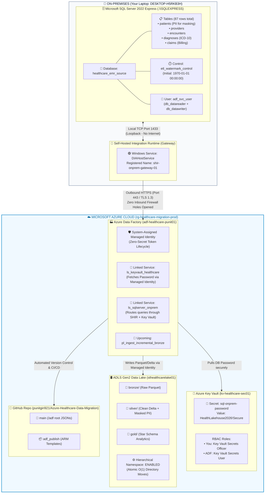

# Master Architectural Walkthrough: Phase 1 & Phase 2 Deconstructed

This document provides an executive, crystal-clear breakdown of **everything built in Phase 1 and Phase 2**. It explains **where** every step occurred, **what values** were configured, and **why** it was necessary from a real-world enterprise engineering perspective.

---

## 🗺️ Visual Architecture Diagram (On-Prem to Cloud)

---

## 📋 Comprehensive Ledger: Place, Value, and Purpose

### PHASE 1: Cloud Provisioning & Zero-Secret Setup

| # | What We Did | Where We Did It | Exact Value / Resource Name | Why We Did It (Real-World Purpose) |
| :- | :--- | :--- | :--- | :--- |
| **1** | Created Resource Group | Azure Portal | `rg-healthcare-migration-prod` (Central India) | Acts as the logical boundary and security container for all Azure resources in this project. Deleting this one group later tears down everything with 0 orphaned charges. |
| **2** | Provisioned Data Lake Storage | Azure Portal | `sthealthcarelake01` (StorageV2) | The central storage layer of our Lakehouse. We enabled **Hierarchical Namespace (HNS)** so directories are true file system folders ($O(1)$ constant-time renames) rather than flat blob URL prefixes ($O(N)$ slow copies). |
| **3** | Created Storage Containers | Azure Portal (Storage Browser) | `bronze`, `silver`, `gold` | Established the 3 Medallion storage zones: **Bronze** for raw ingest, **Silver** for cleansed/PII-masked Delta, and **Gold** for curated reporting stars. |
| **4** | Provisioned Azure Key Vault | Azure Portal | `kv-healthcare-sec01` (RBAC mode) | Centralized, HSM-backed secret vault. Prevents developers and pipelines from ever hardcoding database passwords in plaintext scripts or JSON commits. |
| **5** | Provisioned Data Factory | Azure Portal | `adf-healthcare-punit01` (V2) | The cloud orchestration and compute engine that will run our ETL pipelines, watermark checks, and Mapping Data Flows. |
| **6** | Granted ADF Cloud Permissions | Azure Portal (Access Control IAM) | • `Storage Blob Data Contributor` • `Key Vault Secrets User` | Implemented **Zero-Secret Architecture**. By granting roles to ADF's **System-Assigned Managed Identity**, ADF authenticates directly to the Storage Lake and Key Vault using auto-rotating tokens managed by Microsoft Entra ID. No API keys or passwords exist in pipeline code. |
| **7** | Linked ADF to GitHub | ADF Studio (Manage ➔ Git Configuration) | • Repo: `Azure-Healthcare-Data-Migration` • Branch: `main` • Root: `/adf` | Enterprise source control and CI/CD. Every pipeline, linked service, or dataset you build in ADF Studio is instantly committed as clean JSON in your local Git repo. |

---

### PHASE 2: On-Prem Database & SHIR Gateway Setup

| # | What We Did | Where We Did It | Exact Value / Resource Name | Why We Did It (Real-World Purpose) |
| :- | :--- | :--- | :--- | :--- |
| **1** | Created Local EMR Database | SQL Server via CLI / Script | `healthcare_emr_source` on `.\SQLEXPRESS` | Simulates the internal, legacy hospital Electronic Medical Record (EMR) database running on an on-premises enterprise network. |
| **2** | Seeded Clinical & Billing Data | `sql/02_seed_clinical_data.sql` | 5 tables (87 rows total): `patients`, `providers`, `encounters`, `diagnoses`, `claims` | Provides realistic clinical and financial data for HIPAA testing: patient names & SSNs (to be hashed in Silver), ICD-10 medical codes, and billing claims. |
| **3** | Initialized High-Watermark Table | SQL Server | `dbo.etl_watermark_control` (Initial value: `1970-01-01 00:00:00`) | The state engine for incremental ETL. By checking `WHERE updated_at > last_watermark_value`, our Phase 3 pipeline only extracts new or modified rows, saving compute and avoiding full database scans. |
| **4** | Installed Integration Runtime (SHIR) | Windows PC (Express Setup) | Service: `DIAHostService` ADF Name: `shir-onprem-gateway-01` | **The Bridge**. Because cloud services cannot reach your private computer or corporate network through your router/firewall, this agent runs locally and pulls jobs from Azure via outbound polling. |
| **5** | Registered SHIR Gateway | Express Installer | Auth Token: `Key1` from ADF Studio | Pairs your local Windows machine specifically to your Azure Data Factory instance using mutual cryptographic token trust. |
| **6** | Stored Password in Key Vault | Azure Portal (Key Vault ➔ Secrets) | Secret Name: `sql-onprem-password` Value: `HealthLakehouse2026!Secure` | Protects the local database password in cloud HSM storage. When ADF runs a pipeline, it fetches the password in-memory for 1 millisecond to authenticate to SQL Server. |
| **7** | Created Key Vault Linked Service | ADF Studio (Manage ➔ Linked Services) | `ls_keyvault_healthcare` | Tells Data Factory how to reach Key Vault `kv-healthcare-sec01` using its Managed Identity. |
| **8** | Created SQL Server Linked Service | ADF Studio (Manage ➔ Linked Services) | `ls_sqlserver_onprem` | Tells Data Factory: "Connect to `DESKTOP-H5RKB3H\SQLEXPRESS` database `healthcare_emr_source` through gateway `shir-onprem-gateway-01`, logging in as `adf_svc_user` with the password from `ls_keyvault_healthcare`." |

---

## ❓ 5 Big Questions Answered in Plain English

### 1. "Why couldn't ADF in Azure just connect directly to my SQL Server without SHIR?"
> **The Problem**: Your computer (or a hospital's database) is behind a private router, NAT, and firewall. It does not have a public IP address. Azure has no way of reaching your laptop from the internet. Furthermore, corporate security and HIPAA compliance strictly forbid opening inbound firewall ports into clinical databases.
> 
> **The Solution (SHIR)**: The Self-Hosted Integration Runtime lives inside your local network. It dials **outward** to Azure over standard secure HTTPS (port 443). ADF never touches your database directly; instead, ADF hands the query to the SHIR agent, the agent runs the query locally on `localhost:1433`, compresses the data into Parquet, and streams it up to Azure. **0 firewall holes opened.**

### 2. "Why did we need Azure Key Vault? Why not just type the password into ADF?"
> **The Problem**: If you type the database password directly into ADF, that password is saved in plaintext or easily readable JSON format. Because ADF is linked to GitHub, pushing code would leak your password to the public Git repository!
> 
> **The Solution**: We store the password in Azure Key Vault. In ADF, we simply write: *"Go ask `ls_keyvault_healthcare` for secret `sql-onprem-password`."* When you look at the committed file [`ls_sqlserver_onprem.json`](file:///d:/01_Ex_Files_Intermediate_SQL_for_Data_Scientists/Goodly%20PowerBi/Azure-Healthcare-Data-Migration/adf/linkedService/ls_sqlserver_onprem.json), notice lines 13–20: **there is zero password text in the file**!

### 3. "Why did Key Vault give an 'unauthorized by RBAC' error earlier?"
> **The Concept**: Modern Azure Key Vaults use **Azure RBAC** (Role-Based Access Control) which strictly separates the **Management Plane** from the **Data Plane**:
> - *Management Plane*: Creating, updating, or deleting the Key Vault itself (you had permission as Subscription Owner).
> - *Data Plane*: Reading or writing the secrets *inside* the vault.
> 
> By default, Azure does not give subscription owners data-plane access. You had to explicitly grant your personal account the **`Key Vault Secrets Officer`** role to add secrets.

### 4. "Why did the SQL Server connection test fail initially, and what did TCP/IP and SQL Browser have to do with it?"
> **The Concept**: SQL Server Express is designed for single-user local applications, so Microsoft disables network TCP/IP by default to reduce the attack surface.
> 1. It only accepted local shared-memory connections, so the SHIR service could not connect over network protocols until we set `Tcp\Enabled = 1` on port `1433`.
> 2. `SQL Server (SQLEXPRESS)` is a **named instance**, meaning it runs on dynamic ports rather than standard port 1433. The **SQL Server Browser** service is the "phonebook" that tells connecting clients which port `\SQLEXPRESS` is currently listening on. Starting SQL Browser allowed the SHIR agent to locate the instance immediately.

### 5. "What did connecting ADF to GitHub actually do?"
> It eliminated manual JSON exports. Every time you click "Apply" or "Save" on a linked service, pipeline, or dataset in ADF Studio:
> - ADF automatically writes the exact JSON specification into the `main` branch of your GitHub repository under the `/adf` folder.
> - When we ran `git pull --rebase` locally, those exact files ([`ls_sqlserver_onprem.json`](file:///d:/01_Ex_Files_Intermediate_SQL_for_Data_Scientists/Goodly%20PowerBi/Azure-Healthcare-Data-Migration/adf/linkedService/ls_sqlserver_onprem.json), [`ls_keyvault_healthcare.json`](file:///d:/01_Ex_Files_Intermediate_SQL_for_Data_Scientists/Goodly%20PowerBi/Azure-Healthcare-Data-Migration/adf/linkedService/ls_keyvault_healthcare.json), and [`shir-onprem-gateway-01.json`](file:///d:/01_Ex_Files_Intermediate_SQL_for_Data_Scientists/Goodly%20PowerBi/Azure-Healthcare-Data-Migration/adf/integrationRuntime/shir-onprem-gateway-01.json)) downloaded right into your local VS Code workspace!
