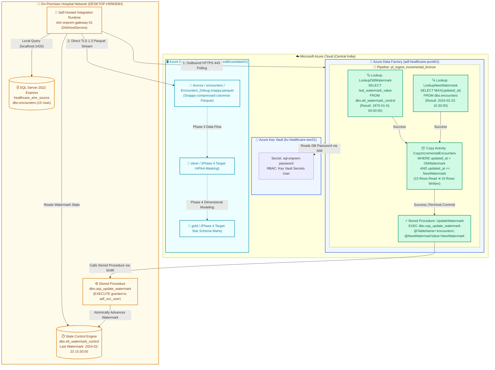

# Phase 3 Architectural Walkthrough: Metadata-Driven Watermark Ingestion (Bronze)

## 1. Executive Summary
In **Phase 3**, we designed, deployed, and verified a production-grade **Incremental Delta Ingestion Pipeline** (`pl_ingest_incremental_bronze`) connecting our private on-premises electronic medical records (EMR) database to the raw **Bronze layer** of our Azure Medallion Lakehouse.

Rather than running expensive and disruptive full-table dumps, the pipeline employs a **High-Watermark Control Pattern** governed by an atomic SQL Server state table (`dbo.etl_watermark_control`) and a stored procedure (`dbo.usp_update_watermark`).

---

## 2. Visual Architecture Diagram (Mermaid)

---

## 3. Detailed Step-by-Step Activity Breakdown

| Activity | Name | Purpose | Underlying Query / Command | Execution Runtime | Evidence Status |
| :--- | :--- | :--- | :--- | :--- | :--- |
| **Activity 1** | `LookupOldWatermark` | Reads lower boundary timestamp from control table. | `SELECT last_watermark_value FROM dbo.etl_watermark_control WHERE table_name = 'encounters'` | `shir-onprem-gateway-01` (17s) | 🟢 Succeeded (`1970-01-01`) |
| **Activity 2** | `LookupNewWatermark` | Captures snapshot max timestamp from source table. | `SELECT ISNULL(MAX(updated_at), '1970-01-01') AS new_watermark FROM dbo.encounters` | `shir-onprem-gateway-01` (19s) | 🟢 Succeeded (`2024-02-23 15:30:00`) |
| **Activity 3** | `CopyIncrementalEncounters` | Streams delta records directly to ADLS Gen2 as Snappy Parquet. | Dynamic SQL query with parameterized upper & lower timestamps. | `shir-onprem-gateway-01` (18s) | 🟢 Succeeded (15 rows copied) |
| **Activity 4** | `UpdateWatermark` | Atomically commits new watermark after successful copy. | `EXEC dbo.usp_update_watermark @TableName='encounters', @NewWatermarkValue='...'` | `shir-onprem-gateway-01` (10s) | 🟢 Succeeded (State saved) |

---

## 4. Key Architectural Guarantees Established

### 1. Zero Data Loss / At-Least-Once Delivery
The stored procedure activity has an **unconditional dependency on the success of the Copy Activity**. If a network outage occurs midway through file generation, the watermark control table remains untouched. The subsequent pipeline retry extracts the exact same slice.

### 2. Snapshot Isolation Against Active Writes
Because the pipeline explicitly enforces `updated_at <= NewWatermark`, any emergency room admission or doctor note inserted into SQL Server *while* the Copy Activity is reading will be cleanly deferred to the subsequent scheduled run.

### 3. Perimeter Security (HIPAA § 164.312)
No inbound firewall rules exist on the hospital LAN router. All communication is driven outbound over **HTTPS 443 with TLS 1.3** by the Windows service daemon `DIAHostService`. Data serialization to Parquet occurs in-memory on the on-premises host before being streamed out.

---

## 5. Artifacts Generated & Committed
* **ADF Pipeline:** [adf/pipeline/pl_ingest_incremental_bronze.json](file:///d:/01_Ex_Files_Intermediate_SQL_for_Data_Scientists/Goodly%20PowerBi/Azure-Healthcare-Data-Migration/adf/pipeline/pl_ingest_incremental_bronze.json)
* **ADLS Gen2 Linked Service:** [adf/linkedService/ls_adls_healthcare.json](file:///d:/01_Ex_Files_Intermediate_SQL_for_Data_Scientists/Goodly%20PowerBi/Azure-Healthcare-Data-Migration/adf/linkedService/ls_adls_healthcare.json)
* **Bronze Dataset:** [adf/dataset/ds_adls_bronze_parquet.json](file:///d:/01_Ex_Files_Intermediate_SQL_for_Data_Scientists/Goodly%20PowerBi/Azure-Healthcare-Data-Migration/adf/dataset/ds_adls_bronze_parquet.json)
* **Source Datasets:** [adf/dataset/ds_sql_encounters.json](file:///d:/01_Ex_Files_Intermediate_SQL_for_Data_Scientists/Goodly%20PowerBi/Azure-Healthcare-Data-Migration/adf/dataset/ds_sql_encounters.json), [adf/dataset/ds_sql_watermark_control.json](file:///d:/01_Ex_Files_Intermediate_SQL_for_Data_Scientists/Goodly%20PowerBi/Azure-Healthcare-Data-Migration/adf/dataset/ds_sql_watermark_control.json)
* **SQL Stored Procedure:** [sql/04_create_watermark_stored_procedure.sql](file:///d:/01_Ex_Files_Intermediate_SQL_for_Data_Scientists/Goodly%20PowerBi/Azure-Healthcare-Data-Migration/sql/04_create_watermark_stored_procedure.sql)
* **Draw.io Architectural Blueprint:** [docs/phase3_watermark_architecture.drawio](file:///d:/01_Ex_Files_Intermediate_SQL_for_Data_Scientists/Goodly%20PowerBi/Azure-Healthcare-Data-Migration/docs/phase3_watermark_architecture.drawio)
